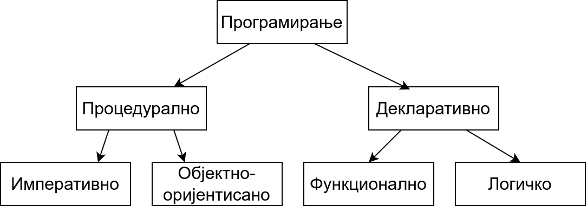

О програмским језицима и програмским парадигмама
================================================

Током историјата развоја рачунарства и програмирања коришћени су разни
програмски језици. У почетку су се рачунари чак програмирали
хардверски (преспајањем жица, тј. каблова), али брзо се прешло на
софтвер и поступак програмирања какав данас знамо.

Програмер пише програм на неком програмском језику и постоје два
начина да се тај програм изврши помоћу рачунара: компилација и
интерпретација. Један начин је да се програм помоћу посебног програма
званог **компилатор** (каже се и **компајлер**, енг. *compiler*)
преведе на машински језик, тј. низ нула и јединица, који хардвер
рачунара може директно да извршава. Машински програм се смешта у
меморију рачунара и садржи инструкције чијим извршавањем хардвер
решава задатак. Други начин је да програм зван **интерпретатор**
(енг. *interpreter*) анализира написани програм део по део (обично
једну по једну наредбу) и сваку анализирану наредбу извршава. За
разлику од компилатора код којих фаза превођења програма претходи фази
извршавања, што значи да се једном преведени програм може покретати
више пута, код интерпретатора су фаза анализе програма и његовог
извршавања испреплетане, не постоји превод на машински језик, па се
при сваком покретању програма он мора изнова анализирати, што обично
доводи до споријег извршавања програма. Са друге стране, ово
програмерима даје већу флексибилност, јер приликом малих измена
програма не морају да цео велики програм преводе из почетка и да
повезују преведене компоненте у једну целину (извршиву датотеку), већ
могу брже да га покрену, поставе на систем на ком ће се извршавати и
слично.

Пошто и компилација и интерпретација имају своје предности и мане
постоје значајни језици које користе сваки од ових приступа. Језици
попут језика C, C++, Pascal, Fortran се традиционално компилирају, док
се језици попут језика Python и JavaScript традиционално
интерпретирају. За неке језике постоје и компилатори и интерпретатори
(на пример, за Haskell или Prolog). Неки језици, попут језика Java или
C# користе приступ који комбинује елементе компилације и
интерпретације (тај приступ нећемо детаљније истраживати у овом
курсу).

Програмски језици на којима програмер задаје опис програма рачунару су
се током година мењали и, као што то вероватно већ знате, до данас су
креиране хиљаде различитих програмских језика.

Језици су утицали једни на друге и обично се њихови историјијски
развој представља стаблом или графом програмских језика. Један такав
граф је приказан у документу
https://www.levenez.com/lang/lang.pdf. Приметите колико је велики број
језика који су приказани на овом дијаграму. Можемо видети, на пример,
Природно је поставити питање који су разлози за настанак оволиког
броја програмских језика. Наравно, главни разлог је то што је
технологија превођења с временом напредовала и људи су пронаналзили
нове језичке конструкције које омогућавају да се програмира
једноставније. На пример, прве верзије језика Fortran нису подржавале
чак ни петље и програмер је морао унапред да одреди колико пута жели
да се неки део програма изврши и да понови тај кôд неколико пута.
Нови програмски језици, али и нове верзије постојећих језика су
уводиле нове језичке конструкције. Нове језичке конструкције су довеле
до тога да програмери могу да се изражавају много апстрактније, без
потребе да наведу сваки детаљ који је потребан да би се програм на
крају могао извршити. Програмски језици, тј. њихови преводиоци су у
стању да попуне многе детаље. На пример, раније су програмери морали
да експлицитно управљају меморијом, тј. да издају наредбе којом се
ослобађа меморија која више није потребна, док у многим савременим
језицима о томе води рачуна специјализована компонента која се назива
*сакупљач отпада* (енг. garbage collector). Програмирање у савременим
програмским језицима који нуде овакве функционалности је веома
популарно, чак иако програми написани у таквим језицима могу бити
спорији. На пример, иако се програми написани у програмском језику C
извршавају брже него програми написани у програмском језику Java, Java
је постала језик избора за програмирање мобилних апликација, пре свега
због удобности програмирања која омогућава брже писање програма, али и
смањује могућност грешака (на пример, сакупљач отпадака успорава
програм, али онемогућава „цурење меморије”, тј. трошење меморије на
блокове које је програмер алоцирао, па заборавио да ослободи).

Језици су се, с временом, специјализовали и поред језика опште намене,
појавили су се језици који су посебно прилагођени одређеним
применама. На пример, неки језици, попут језика SQL, намењени су само
писању упита база података, неки, попут језика PHP и JavaScript
намењени су само веб програмирању и слично.

Без оваквих иновација на пољу програмских језика, развој комплексног
софтвера какав данас користимо био би готово извесно немогућ. Наиме,
већ крајем 1960-их година софтверска индустрија запада у
тзв. **софтверску кризу** и постаје јасно да до тада коришћени језици
и методологија програмирања не успевају да испрате развој хардвера тј.
да на тај начин није могуће довољно брзо развити ефикасне и сложене
програме који би искористили све могућности тадашњег хардвера који је
постајао све моћнији. Стога је софтверска индустрија тог доба подржала
развој нових језика и нових приступа програмирању, брзо усвајала
новине, а и сама, уз академију, значајно учествовала у истраживањима
на овом пољу.

Сваки програмски језик има своје специфичности, али се ипак разликују
по програмским конструкцијама које ти језици подржавају. На пример,

- неки програмски језици подржавају измену вредности променљивих и
  петље, а неки не;

- неки програмски језици подржавају дефинисање класа и објеката, а
  неки не;

- неки програмски језици захтевају да корисник дефинише типове
  променљивих пре њихове употребе, а неки не, већ тип променљиве
  одређују на основу вредности која им је додељена;

- неки програмски језици допуштају да функције буду параметри других
  функција, а неки не;

- неки програмски језици гарантују да ће функција за исте аргументе
  увек вратити исту вредност, а неки не;

- неки програмски језици захтевају од програмера да изда наредбу за
  ослобађање меморије која више није потребна, а неки то раде
  аутоматски, коришћењем тзв. сакупљача отпадака (енгл. *garbage
  collector*);

- неки програмски језици на основу одређених ограничења које решење
  проблема треба да задовољи могу самостално, помоћу уграђених
  алгоритама, да пронађу решење, а неки то не подржавају, него
  програмер мора увек да зада алгоритам којим се долази до решења.

Дакле, постоје заиста различите карактеристике по којима можемо
класификовати програмске језике. Међутим, показује се да постоје неке
веома важне групе карактеристика које прилично одређују начин на који
се уопште приступа поступку програмирања и решавању проблема. На
основу те, слободно можемо рећи најзначајније поделе, програмски
језици се групишу у тзв. **програмске парадигме**. Реч парадигма је
грчког порекла и значи пример за углед, узор или образац и обично се
користи да означи групу елемената који имају заједничке
карактеристике. Стога програмска парадигма одређује начин решавања
програмерских проблема, начин или стил програмирања, начин писања
програма коришћењем карактерисничних елемената програмског језика и
слично. Јасно је да је подела на програмске парадигме ствар договора и
да постоје различити критеријуми по којима се програмски језици могу
класификовати. Ипак, с временом су се издвојиле четири основне
парадигме о којима ће детаљно бити речи у овом курсу.

1. **Императивна (процедурална)** парадигма
   
2. **Објектно-оријентисана** парадигма
   
3. **Функционална** парадигма
   
4. **Логичка** парадигма

Са императивном и са објектно–оријентисаном парадигмом сте се већ
срели у ранијем школовању, а функционалну и логичку парадигму ћете
упознати у овом курсу.

Пошто језици који припадају истој парадигми деле пуно заједничких
карактеристика, много је лакше након једног наученог језика прећи на
други језик који припада истој него на други језик који припада некој
другој парадигми. На пример, онај ко је савладао императивну парадигму
кроз програмски језик *Pascal* много ће лакше научити да програмира у
језику *C*, који је такође императиван и користи мање-више исте
основне појмове (променљиве, изразе, наредбе, петље...), него у језику
*Java* који је објектно-оријентисан (и захтева да се науче нови
појмови попут учауравања, наслеђивања, полиморфизма) или у језику
*Haskell* који је функционалан (и захтева да се науче нови појмови
попут функција вишег реда, референцијалне транспарентности,
алгебарских типова података и слично).

Иако постоје програмски језици који подржавају искључиво једну
парадигму, најкоришћенији програмски језици данас углавном подржавају
коришћење неколико парадигми (данас су то најчешће императивна,
објектно-оријентисана и функционална, док је логичка ипак резервисана
за посебне програмске језике). За такве језике кажемо да су
**мултипарадигматични** или **мултипарадигамски**
(енг. multi-paradigm). Познавање свих парадигми је зато данас веома
важно, да би се у тим језицима пронашао стил програмирања који
омогућава коришћење елемената сваке парадигме на најбољи начин
тј. комбиновање добрих и избегавање лоших карактеристика сваке
парадигме.

Све четири основне парадигме су се појавиле прилично рано у развоју
рачунарства. Императивна парадигма је настала крајем 1950-их кроз
програмски језик *Fortran*. Функционална је настала већ почетком
1960-их кроз *Lisp*. Објектно-оријентисана парадигма је почела да се
развија још крајем 1960-их кроз језике *Simula-67* и *Simula-69*, али
је ширу популарност стекла почетком 1980-их кроз *Smalltalk-80*. И
логичка је настала почетком 1970-их кроз *Prolog*. Све парадигме су
касније унапређиване и дорађиване кроз нове језике који им припадају.
Императивна и објектно-оријентисана парадигма се сматрају доминантним
парадигмама у развоју софтвера и логички и функционални програмски
језици никада нису достигли ниво употребе који имају императивни и
објектно-оријентисани језици. Међутим, карактеристике и стил
програмирања у тим језицима, нарочито функционалним, у новије време су
се веома проширили кроз мултипарадигматичне језике и на тај начин се
веома интензивно користе у развоју софтвера. Функционални језици (пре
свега Haskell) се користе у софтверској индустрији (на пример,
компанија Facebook је у овом језику имплементирала значајан део својих
система), а готово сви најважнији концепти функционалног програмирања
су данас присутни у савременим језицима Python, JavaScript, C#, па чак
и у језику C++.

Поред четири основне парадигме, помињу се још неке чији се елементи
користе у разним програмским језицима (на пример, скрипт парадигма,
конкурентна парадигма, компонентна парадигма, парадигма упитних
језика, реактивна парадигма, генеричка парадигма, агентна парадигма,
итд.).

Процедуралност и декларативност
-------------------------------

Поступак програмирања постаје једноставнији што је већи ниво
апстракције на ком програмер може да се изражава.

Хардвер разуме само **машински језик**, тј. низ нула и јединица које
му диктирају како електрични сигнали треба да се крећу кроз рачунарски
систем, покрећу његове делове и на тај начин врше израчунавања,
обрађују податке, приказују слике и слично.

Програмирање директним уношењем нула и јединица у меморију рачунара је
страшно мукотрпно и људи су веома брзо дошли до **асемблерских
језика** којима на симболички начин задају инструкције рачунару.  На
пример, асемблерски програм

.. code-block::

   mov eax, 5
   mov ebx, [0xff35]
   add eax, ebx

садржи три инструкције. Прва налаже да се у регистар процесора ``eax``
упише вредност 5, друга да се у регистар ``ebx`` пренесе вредност из
меморије са наведене адресе, док трећа да се саберу бројеви у регистру
``eax`` и ``ebx`` (при чему се подразумева да ће збир бити смештен у
регистар ``eax``). Програмирање на асемблеру захтева да програмер
познаје све детаље рачунара (инструкције процесора, регистре,
меморијске адресе и слично), што чини процес програмирања веома
компликованим, а програме непреносивим са једног на други рачунар.

Савремени тзв. **виши програмски језици** се појављују средином
1950-их, са програмским језиком Fortran. Основна новина је то што
програмер израчунавање описује на апстрактнијем, математичком нивоу, а
посебан програмски преводилац (компилатор) преводи тај програм на
асемблерски тј. на машински језик. Име првог реализованог вишег
програмског језика Fortran је скраћеница од FORmula TRANslator, што
указује управо на то да је то систем који математичке формуле може да
преведе на језик разумљив рачунару. Тиме програмер не мора више да
води рачуна о многим техничким детаљима (на пример, распоређивању
података по меморији и регистрима процесора), већ то компилатор ради
уместо њега. С временом су компилатори постајали све напреднији и
преузели су разне послове програмера (на пример, данас се сматра да
компилатори кроз оптимизацију кода који врше могу да произведу много
бржи машински код него што би то програмери могли ручно да ураде).

Развој виших програмских језика и програмских преводилаца стално
спушта лествицу онога што програмер мора да уради да би дошао до
ефикасног извршног програма тј. процес програмирања с временом постаје
све једноставнији. Он је додатно олакшан мноштвом библиотека које
пружају готову функционалност којима се лако приступа помоћу
**апликативних програмских интерфејса** (енг. *application programming
interface*, *API*).

Циљ који (у општем случају) никада није достигнут, али коме се стално
тежи и све више приближава, јесте тај да је довољно да програмер
рачунару само опише проблем који је потребно решити, а да рачунар онда
сам проналази решење тог проблема. Такви системи се називају
**декларативни**, насупрот традиционалним системима у којима програмер
мора да опише алгоритам тј. процедуру, па се ти системи називају
**процедурални**. Декларативно програмирање подразумева да програмер
задаје **шта** треба да се уради, а не и **како** то треба да се
спроведе у дело. Ова подела није стриктна и програмирање с временом
постаје све више декларативно и све мање процедурално. На пример,
данас је скоро у свим језицима довољно позвати библиотечку функцију за
сортирање да би се низ сортирао и није потребно описивати алгоритам
сортирања.

Сматра се да функционална, а нарочито логичка парадигма доприносе
декларативнијем програмирању, док су објектно-оријентисана и
императивна парадигма много процедуралније. Стога се у неким књигама
наводи да је основна подела на процедуралну и декларативну парадигму,
а затим се процедурална парадигма дели на императивну и
објектно-оријентисану, а декларативна на функционалну и логичку.

Ми нећемо користити ову поделу, јер ни функционално ни логичко
програмирање нису сасвим декларативни и захтевају често да програмер
ипак опише процедуру, тј. алгоритам решавања проблема.

.. infonote::
  
   Постоји терминолошка нејасноћа која се тиче императивне и
   процедуралне парадигме. Неки аутори под процедуралном парадигмом
   подразумевају све језике у којима програмер описује процедуру
   (поступак, алгоритам) решавања проблема (претходни текст је
   користио ту терминологију). У тој терминологији императивна
   парадигма је једна од најзначајнијих подврста процедуралне
   парадигме и у њој програмер задаје алгоритам коришћењем наредби.

   Са друге стране, неки аутори користе поделу на императивну и
   декларативну парадигму и под императивном парадигмом подразумевају
   свако програмирање у коме програмер описује алгоритам решавања
   проблема. Термин процедурално се тада користи за подврсту
   императивне парадигме у којој се програми пишу тако што се сложен
   проблем разбије на више потпроблема који се решавају писањем
   појединачних функција и процедура у програмском језику (програмски
   језик Pascal је потпрограме називао баш процедуре и функције).

   .. image:: ../../_images/paradigme-podela-2.png
      :align: center
      :width: 350px
   

   Како год да се одлучимо, јасно је да су процедурална и императивна
   парадигма веома тесно повезане и нећемо инсистирати у наставку
   превише на овим финим разликама у њиховим прецизним дефиницијама.

Решења написана у декларативним програмским језицима могу (мада не
морају) да буду мало неефикаснија него она написана у процедуралним
тј. императивним. Међутим, предности које користи коришћење
декларативног приступа често то надомешћују. Наиме, програми су по
правили краћи, лакше се пишу, лакше се разумеју и одржавају, лакше се
тестирају, имају мање грешака, лакше се верификују тј. њихова
коректност се лакше доказује и слично. У савременом свету у ком су
рачунари постали довољно брзи и имају велике количине меморије, То што
програми троше мало више „процесорског времена” и меморије често је
мање важно од тога што увелико штеде „програмерско време”.
   
Машинско учење као нова декларативна парадигма
----------------------------------------------

Нова, веома важна парадигма, драстично другачија од свих претходних,
заснована је на вештачкој интелигенцији и **машинском учењу**. На
пример, системи за препознавање слика тј. објеката на сликама, раде
тако што су програмери припремили велики број слика и обележили
објекте на њима, а онда је систем анализирао те слике и научио како да
препозна објекте на сликама. Приметимо да у овој парадигми програмер
није задавао алгоритам препознавања, већ је машина сама дошла до
алгоритма, учењем из података које је прогамер требало да
припреми. Прецизније алгоритам који се спроводи је фиксиран и зависи
од великог броја параметара, а машинским учењем се ти параметри
аутоматски подешавају да тако „наштимован“ алгоритам решава задатак
који је потребно да реши. Ова парадигма је по својој природи веома
декларативна и заиста ослобађа програмера потребе да дизајанира и
описује алгоритам за решавање конкретног проблема.

У последње време су се појавили многи системи засновани на вештачкој
интелигенцији (на пример, ChatGPT или GitHub Copilot) који на основу
текстуалног описа проблема могу да генеришу програмски код за његово
решавање. Тиме се веома подиже ниво апстракције и приближава се у
великој мери основној идеји декларативности (где програмер само треба
прецизно да опише проблем, а рачунар самостално проналази алгоритам за
његово решавање).

Задаци за самостални рад
------------------------

1. Потражите на интернету појам програмске парадигме. Шта се све
   наводи као програмска парадигма? Продискутујте који су најчуднији
   концепти до којих вас је та претрага довела?

2. Проучите детаљније који језици користе компилаторе, а који
   интерпретаторе. Покушајте да пронађете шта су виртуелне машине
   (нпр. JVM и .NET). Пронађите на интернету шта је *Just-in-time
   compiler, JIT* и је *Ahead-of-time compiler, АОТ*.

3. Функционална парадигма се појавила веома рано (још са програмским
   језиком LISP), међутим, није одмах добила на
   популарности. Истражити зашто је то било тако и који су разлози да
   сви данашњи популарни језици (Python, C#, па чак и C++) усвајају
   основне елементе функционалне парадигме. На пример, сакупљање
   отпада (енгл. garbage collection) се појавило у функционалним
   језицима, а данас се подразумева у индустријским језицима као што
   су Java и C#.

4. Haskell је индустријски функционални програмски језик у ком је
   испрограмирана велика количина кода која се користи у компанији
   Фејсбук. Истражити зашто је то тако.
