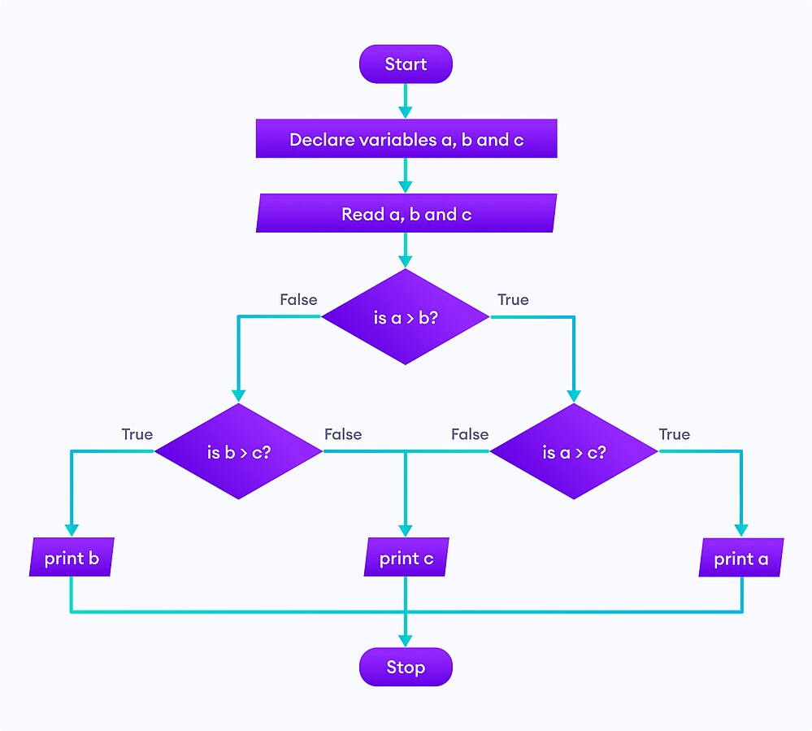

Императивна парадигма
=====================

Императивна парадигма је најстарија парадигма и тесно је повезана са
начином функционисања хардвера. Императивни програми се састоје из
**наредби** којима се рачунару задаје како да измени податке који су
смештени у меморији рачунара. Сви машински и асемблерски језици су
императивни (при чему су наредбе тамо заправо инструкције којима се
процесору задаје како да податке обради).

Кључан појам при извршавању сваког императивног програма је његово
текуће **стање** које одређују променљиве које тај програм користи и
које се мења током извршавања програма (кажемо да је стање
**мутабилно**). Основна наредба којом се мења стање програма је
**наредба доделе**, којом се променљивој додељује вредност. Поред
наредбе доделе, користе се наредбе за контролу тока: гранање
(нпр. наредба ``if``) и петље (нпр. наредбе ``while`` и ``for``). У
изградњи наредби користе се **изрази** (на пример, изрази се наводе са
десне стране наредбе доделе и у условима петљи и наредби
гранања). Алгоритам се описује низом наредби које рачунар извршава
секвенцијално, једну за другом (при чему гранање и петље дефинишу
другачију контролу тока).

На пример, размотримо наредни фрагмент императивног кода у језику C#:

.. code-block:: csharp

   int x = 3;
   int n = 4;
   int i = 0;
   int stepen = 1;
   while (i < n) {
       stepen = stepen * x;
       i = i + 1;
   }

У њему учествују 4 променљиве (``x``, ``n``, ``i`` и ``stepen``). На
почетку програма врши се њихова иницијализација и пре уласка у петљу
вредности ових променљивих су редом 3, 4, 0 и 1. Током петље стање
програма се мења на следећи начин:

+-----+-----+-----+--------+
|  x  |  n  |  i  | stepen |
+=====+=====+=====+========+
|  3  |  4  |  0  |   1    |
+-----+-----+-----+--------+
|  3  |  4  |  1  |   3    |
+-----+-----+-----+--------+
|  3  |  4  |  2  |   9    |
+-----+-----+-----+--------+
|  3  |  4  |  3  |   27   |
+-----+-----+-----+--------+
|  3  |  4  |  4  |   81   |
+-----+-----+-----+--------+

Промена вредности променљиве је специфична особина императивних
програма и не среће се у математици. Почетнике често збуњује наредба
доделе ``i = i + 1;``, јер је тумаче као математичку једначину, што,
наравно, нема смисла. Семантика ове наредбе је *променљивој i
треба доделити вредност која је за један већа од тренутне вредности
променљиве i*.

Основна техника изражавања алгоритама је **итерација**, која
подразумева да се до коначне вредности долази тако што се мало по мало
ажурира вредност неке променљиве (као што је у претходном примеру
вредност променљиве ``stepen`` ажурирана мало–по–мало, све док није
достигла жељену вредност 81). Итерација се остварује уз помоћ петљи и
често се појам итерације поистовећује са петљама (додуше, ако је
унапред познато колико пута је потребно променити вредност неке
променљиве, итерацију је могуће извршити и без петљи).

Наредба доделе јесте главни, али није и једини начин да се промени
вредност неке променљиве, тј. стање програма. На пример, оператори
``++`` и ``--`` у програмском језику C# увећавају односно умањују
вредност променљиве за 1. Кажемо да ти оператори имају **бочне
ефекте** (можемо рећи и *пропратне ефекте* или *споредне ефекте*,
енг. *side effect*). Бочни ефекат могу имати и функције које приликом
позива мењају вредности неких глобалних променљивих.

Основно стање програма заиста сачињава вредност његових променљивих.
Међутим, сви програми врше и неку интеракцију са улазно-излазним
уређајима (исписују или исцртавају нешто на екран, реагују на тастере
тастатуре или померање миша и слично, записују нешто у датотеку или
читају нешто из датотеке, комуницирају преко мреже и слично). И за
функције које врше овакве интеракције се такође каже да имају бочне
ефекте.

Структурирано програмирање
--------------------------

Процесор контролу тока програма остварује помоћу условних и
безусловних скокова. Наредбе у програму могу бити означене
тзв. лабелама и постоје инструкције којима се задаје скок на неку
лабелу (што значи да извршавање програма треба да се настави од
инструкције на задатој лабели) и инструкције којима се задаје скок на
неку лабелу под неким условом (ако тај услов није испуњен, онда се
програм наставља нормалним током, од инструкције која се налази иза
инструкције скока). На пример:

.. code-block:: asm

      mov eax, 5
   pocetak:
      cmp eax, 0
      je kraj
      dec eax
      jmp pocetak
   kraj:
      call print

У претходном асемблерском програму је реализована једна једноставна
петља. У првој инструкцији уписује се вредност 5 у регистар ``eax``.
У наредној се помоћу инструкције ``cmp`` пореди вредност у регистру
``eax`` са 0. Затим следи условни скок на крај петље где се налази
инструкција којом се позива функција исписа. Инструкција ``je`` врши
скок, ако је у претходном поређењу откривена једнакост. Дакле, ако у
``eax`` јесте вредност 0, скаче се на крај петље, а ако није, наставља
се са следећом инструкцијом у петљи, а то је ``dec eax`` којом се
вредност у регистру ``eax`` умањује за 1. Након тога следи инструкција
безусловног скока ``jmp`` којом се контрола тока враћа на почетак наше
петље. Дакле, у телу петље се вредност у регистру ``eax`` смањује за 1
све док не дође до нуле, када се искаче из тела петље. 

Под утицајем хардвера, тј. асемберских језика који директно осликавају
процесорске инструкције рани виши програмски језици имали су наредбу
скока која је обично називана GOTO. Она је била карактеристична за
језике попут језика Fortran и BASIC. Претходна петља би се у језику
BASIC могла записати овако.

.. code-block:: basic

   10 X = 5
   20 IF X = 0 THEN GOTO 50
   30 X = X - 1
   40 GOTO 20
   50 PRINT(X)

Свака наредба има свој број и наредбом GOTO врши се скок на наредбу са
задатим бројем.

Парадигма у којој се наредбе извршавају секвенцијално, једна за
другом, а ток програма се мења наредбом скока (GOTO) назива се понекад
**композитна парадигма**.

У савременом програмском језику претходни програм би се записао као

.. code-block:: csharp

   int x = 5;
   while (x != 0)
       x--;
   print(x);

Иако је овакав стил програмирања успешно коришћен у раном развоју
рачунарства, врло брзо је уочено да програми који користе наредбу GOTO
могу да постану веома тешки за разумевање и одржавање. Размотримо
следећи пример.

.. code-block:: basic

    10 INPUT(A)
    20 IF A < 0 THEN GOTO 60
    30 IF A > 0 THEN GOTO 80
    40 PRINT("NULA")
    50 GOTO 100
    60 PRINT("NEGATIVAN")
    70 GOTO 90
    80 PRINT("POZITIVAN")
    90 GOTO 10
    100 END

Да ли можете да погодите шта овај програм ради? Размислите како би се
он могао записати у савременом језику? Ево еквивалентног кода у језику
C#.

.. code-block:: csharp

    int a;
    do {
       a = int.Parse(Console.ReadLine());
       if (a < 0)
          Console.WriteLine("NEGATIVAN");
       else if (a > 0)
          Console.WriteLine("POZITIVAN");
       else
          Console.WriteLine("NULA");
    } while (a != 0);

Из овог доба долазе и чувени дијаграми тока програма на којима се
графички приказују скокови и везе измећу наредби.

У компликованијим програмима наредбе скока толико „запетљају“ контролу
тока, да су такви програми шаљиво називани „шпагети“ програми. Долази
до тзв. „софтверске кризе“, што је термин у ком се описује период када
због лоше методологије није могуће довољно брзо развити софтвер који
би искористио све расположиве могућности савременог хардвера тј. када
развој софтвера значајно заостаје за развојем хардвера. Криза се
препознаје по томе што софтверски пројекти трају дуже и троше више
новца него што је предвиђено, софтвер који се направи је обично ниског
квалитета, неефикасан је, незадовољава захтеве корисника и јако тешко
се одржава и проширује зато што је програмски кôд превише компликован.
Криза током 1960-их је прва софтверска криза. Чувени информатичар
Дајкстра који је први и употребио термин „софтверска криза“ је
1968. објавио чланак `GOTO statement considered harmful
<https://homepages.cwi.nl/~storm/teaching/reader/Dijkstra68.pdf>`_, у
ком је критиковао коришћење наредбе GOTO. Пре тога Бем и Јакопини су
показали да се наредба GOTO може изоставити из програмских језика ако
програмски језици подржавају следећа три типа наредби за контролу
тока:

1. секвенцијално извршавање наредби, једну за другом;
2. наредбу гранања;
3. наредбу понављања (петљу).

И један тип петље у комбинацији са наредбом гранања је довољно
изражајан да одмени произвољан ток изражен помоћу скокова тј. наредбе
GOTO. Ипак, с временом се усталило да програмски језици обично имају
три типа петљи: бројачку петљу у којој променљива редом узима
вредности неког правилног скупа бројева (петља ``for``), условну петљу
с провером услова на почетку (петља ``while``), и условну петљу с
провером услова на крају (петља ``do-while``). Информатичари
инсистирају на томе да се „структура програма“ (данас кажемо контрола
тока) одређује без коришћења скокова, само коришћењем гранања и петљи
(тј. фиксног броја „програмских структура“, како је то тада називано).
Тако се долази до парадигме која је названа **структурирано
програмирање**. Теоријску основу структурног програмирања даје
поменута теорема Бема и Јакопинија. Појављују се и програмски језици
који подржавају ову дисциплину (пре свега Pascal, па затим и
C). Структурирано програмирање уноси дисциплину и доводи до побољшања
квалитета програма (програми се лакше разумеју и одржавају) и данас се
у свим императивним програмским језицима инсистира на дисциплини
структурираног програмирања. Ако програм уопште нема скокова, тада
сваки блок наредби има тачно једну улазну и једну излазну тачку, што
знатно олакшава анализу програма. Због свега наведеног, наредба GOTO у
данашњим језицима или уопште не постоји или се веома ретко користи.

.. infonote::

   Можда једини „оправдани“ случај коришћења GOTO може бити ситуација
   у којој се жели прекид неколико угнежђених петљи, мада се и та
   ситуација релативно једноставно решава без наредбе GOTO.

   .. code-block:: csharp

      for (int i = 0; i < n; i++) {
          for (int j = 0; j < n; j++) {
              for (int k = 0; k < n; k++) {
                  obrada(i, j, k)
                  if (uslov(i, j, k))
                     goto kraj;
              }
          }
      }
      kraj:
      

   GOTO можемо уклонити коришћењем помоћне логичке променљиве.

   .. code-block:: csharp

      bool kraj = false;
      for (int i = 0; i < n && !kraj; i++) {
          for (int j = 0; j < n && !kraj; j++) {
              for (int k = 0; k < n && !kraj; k++) {
                  obrada(i, j, k);
                  if (uslov(i, j, k))
                     kraj = true;
              }
          }
      }
      
   Закључимо ову дискусију једноставним саветом -- нема потребе да у
   својим програмима користите наредбу GOTO.

И у структурираном програмирању неки програмски језици уводе две
посебне наредбе које донекле одговарају наредбама скока. То су наредба
``break`` којом се безусловно врши прекид петље и наредба
``continue``, којом се врши прекид тренутног корака (тренутне
итерације) у петљи. Слично, и наредба ``return`` може довести до
прекида петље током њеног извршавања. Иако су неки аутори сматрали да
и ове наредбе, слично осталим наредбама скока, доприносе конфузији и
компликују програме, с временом се показало да ако се оне користе у
разумној мери, програми остају читљиви и разумљиви, тако да се у
савременом програмирању наредбе ``break`` и ``continue`` користе.

.. infonote::

   Овде видимо први „сукоб“ између доследног држања парадигме и
   потреба практичног програмирања. Теоретичари обично инсистирају на
   „чистом“ коду који се остварује тиме што се стриктно увек држимо
   принципа које нека парадигма прописује (у овом примеру тај принцип
   би био „програм не сме да садржи наредбе скока“). Практичари, са
   друге стране, заговарају често став да је одступање од строгих
   закона неке парадигме допуштено у неким изнимним ситуацијама, у
   којима процењују да то доводи до кода који је на неки начин бољи
   (ефикаснији, краћи...). У овом примеру, увођење наредби ``break`` и
   ``continue`` јесте нарушавање правила да не сме бити наредби
   скокова. То заиста компликује анализу програма, јер, на пример, ако
   смо сигурни да нема наредби скока, знаћемо сигурно да након петље
   ``while`` услов петље није више испуњен, али ако петља садржи
   наредбу ``break``, то више не мора бити тачно. Ипак, пракса
   показује да је корист коришћења наредбе ``break`` већа него штета
   (нарочито ако се она користи ограничено, у складу са неким честим
   идиомима) и данас се та два облика скока користе у програмирању,
   одступајући тиме од строгог канона који структурна парадигма
   заговара.

Приметимо да структурна парадигма са једне стране уводи ограничење на
употребу неких програмских конструкција (скокова и наредбе GOTO), а са
друге уводи нове програмске конструкције (наредбе за организацију
контроле тока, тј. гранања и петљи) које помажу да се не изгуби
изражајност. Иако на први поглед делује да ограничавање употребе неких
конструкција отежава посао програмерима, оно на дуже стазе доводи до
бољег програмског кода који се лакше разуме, одржава и
проширује. Видећемо да све програмске парадигме функционишу по сличном
принципу: ограничавају неке конструкције за које се испоставља да
имају лоше особине, а уместо њих уводе и фаворизују коришћење других
конструкција, које имају боље особине.

Важно је да нагласимо да да је до софтверске кризе дошло у софтверској
индустрији и да је зато софтверска индустрија веома брзо одреаговала
на теоријске резултате, прихвативши промену парадигме и усвојивши
структурирано програмирање. Видећемо да је индустрија генерално
отворена за прихватање нових парадигми и решења која доводе до развоја
квалитетнијих програма.
   
Процедурално програмирање (у смислу потпрограма)
------------------------------------------------

Структурирано програмирање и избегавање скокова су важан начин увођења
дисциплине у императивну парадигму. Други важан корак је разбијање
програма у мање целине. Основни механизам за то је дефинисање
**потпрограма** (некада се каже и **подрутине**,
енг. *subroutine*). Суштински постоје две врсте потпрограма:

- **Функције** одговарају функцијама у математици и њихова улога је да
  на основу датих вредности аргумената израчунају резултат.

- **Процедуре** служе да остваре неки бочни ефекат (испишу нешто на
  екрану, упишу нешто у датотеку, али и промене стање програма
  мењајући вредности неких глобалних променљивих).

Програмски језик Pascal је чак користио различите кључне речи
(``function`` и ``procedure``) за ове две врсте потпрограма, док се у
језику C процедуре остварују као функције које не враћају вредност,
тј. функције чији је повратни тип ``void``. Пошто у већини програмских
језика и функције често могу да имају бочне ефекте, што их удаљава од
идеала математичких функција, раздвајање на процедуре и функције није
претерано значајно (отуда се у језику C и његовим наследницима, а и
многим другим савременим језицима, помињу само функције). Видећемо да
у чистим функционалним језицима (какав је, на пример, Haskell)
функције не могу да имају бочне ефекте и зато одговарају функцијама у
математици, што у великом мери олакшава резоновање о њима, њихову
анализу, као и анализу целих програма написаних коришћењем таквих
функција.

Као што је то обично случај у рачунарству, комплексни проблеми се
најбоље решавају тако што се разложе на мање, једноставније
потпроблеме. **Процедурално програмирање** (при чему под термином
процедура мислимо на потпрограм, а не поступак тј. алгоритам)
подразумева да се за сваки јасно дефинисан потпроблем дефинише засебна
функција, тј. процедура којом се он решава. Потпрограми позивају једни
друге, све до главног програма (који и сам може бити потпрограм, попут
функције ``main`` у језику C) од кога креће извршавање. Изградња
програма обично тече **одозго-наниже** (енг. *top-down*) и програмер
даје опис главног програма у терминима позива потпрограма које тек
касније разрађује.

Пожељно је да развој сваке процедуре буде што независнији од остатка
програма. Стога програмски језици уводе концепт **локалних
променљивих**, преноса вредности у потпрограм и повратка резултата из
њега. Комуникација између потпрограма се може вршити и преко глобалног
стања програма, али то ствара велике зависности између различитих
потпрограма и пожељно је избегавати тај облик комуникације.

Подела великих програма на мање потпрограме је добар корак ка
**модуларизацији**. Након издвајања појединачних потпрограма, јавља се
потреба за организовањем сродних функција и података којима оне
оперишу у модуле, тј. библиотеке које се затим могу укључити и
користити у већем броју програма. То постаје уобичајена пракса у
програмирању и припрема за нову, објектно–оријентисану парадигму у
којој такви модули (објекти, класе) добијају и нове карактеристике
(наслеђивање, полиморфизам).

Имплементација потпрограма је захтевала унапређивање компилатора и
реорганизацију меморије (поделу на програмски стек, хип, сегмент
података и сегмент кода), а када су ти проблеми решени, дошло се до
много боље организације сложених програма.

Једна важна техничка могућност је та да потпрограми могу да позивају
сами себе, чиме се долази до могућности **рекурзивног** описа
алгоритама, који је често много једноставнији.

На пример, упоредимо класичну итеративну имплементацију алгоритма
степеновања и рекурзивну:

.. code-block:: csharp

   long stepen(int x, int n) {
        long s = 1;
        for (int i = 0; i < n; i++)
            s *= x;
        return s;
   }

.. code-block:: csharp

   long stepen(int x, int n) {
      if (n == 0) return 1;
      return x * stepen(x, n-1);
   }

Друга, рекурзивна, дефинција је веома блиска класичној математичкој
дефиницији степена:

.. math::

   \begin{align*}
   & x^0 = 1 \\
   & x^n = x \cdot x^{n-1}, \text{ za } n > 0
   \end{align*}

Рекурзивна функција даје много декларативнији опис него класична
итеративна имплменентација, јер се рачунару заправо не описује како
ова вредност треба да се израчуна (алгоритам израчунавања вредности
рекурзивних функција помоћу стека је познат и њега компилатор генерише
на основу нашег рекурзивног описа). Рекурзија се много интензивније
користи у склопу функционалног и логичког програмирања, о чему ће
много више речи бити касније.

Предности и мане императивне парадигме
--------------------------------------

Основна предност императивне парадигме је то што је она веома блиска
принципима функционисања хардвера тако да се програми прилично
директно могу превести на асемблерски и машински језик. Императивни
програми су, у принципу, најефикаснији.

Мане су низак степен декларативности и обавеза програмера да опише
велики број детаља алгоритма (што штеди „процесорско време“, али троши
„програмерско време“).

Бочни ефектни могу прилично да закомпликују анализу програма. Ако
функција користи и мења глобалне променљиве, тада је могуће да се иста
функција позове са истим аргументима више пута и да сваки пут да
различит резултат и произведе различит ефекат.  Размотримо следећи
пример функције за генерисање насумичних бројева.

.. code-block:: csharp

   class Program {
       const uint a = 1664525;
       const uint c = 1013904223;
       uint num = 0;

       static void seed(uint seed) {
          num = seed;
       }

       static uint random() {
          num = a * num + c;
          return num;
       }

       static void Main() {
          if (2*random() == random() + random())
             Console.WriteLine("Jednako");
          else
             Console.WriteLine("Različito");
       }
   }

Сваки пут када се та функција позове, она ће да врати различит
резултат (што је у овом случају управо оно што и желимо). Она мења
глобално стање (променљиву ``num``) и сваки наредни резултат зависи од
претходног. Са друге стране, услов наредбе ``if`` у функцији ``Main``
неће бити испуњен и биће исписано ``Različito``, иако неко може
очекивати да је ово математичка истина (у математици увек важи да је
:math:`2f(x) = f(x) + f(x)`).

Размотримо и следећи скрипт написан у језику JavaScript.

.. code-block:: javascript

   const canvas = document.getElementById("myCanvas");
   const context = canvas.getContext("2d");

   function drawCircle(x, y, radius) {
      // Postavljamo crvenu boju
      context.fillStyle = "red";

      // Crtamo krug
      context.beginPath();
      context.arc(x, y, radius, 0, 2 * Math.PI);
      context.fill();
   }

   function drawRectangle(x, y, width, height) {
      // Crtamo pravougaonik
      context.fillRect(x, y, width, height);
   }
   
У овом коду су дате две функције: прва која црта црвени круг, а друга
која црта правоугаоник. Само цртање је, наравно, бочни ефекат,
међутим, у овом имплементацији је нарочито проблематична наредба
``context.fillStyle = "red"``, тј.  бочни ефекат који она производи. У
њој се мења стање глобалног објекта ``context`` тако што се поставља
црвена боја попуњавања. Сваки наредни позив функција за цртање
попуњених објеката (функција ``fill``, али и ``fillRect``) ће попунити
нацртани ојбекат том бојом. Ако се прво нацрта правоугаоник, па онда
круг, правоугаоник ће бити нацртан подразумеваном бојом (црном), а
круг црвеном, јер ће се пре цртања круга боја променити на црвену. Са
друге стране, ако се прво нацрта круг, па правоугаоник, оба облика ће
бити нацртана црвено, јер јер приликом цртања круга, кроз бочни
ефекат, измењен глобални објекат.
   
Дакле, постојање бочних ефеката у функцијама намеће програмеру обавезу
да мисли о редоследу и историји позива функција. Да би се анализирао
неки позив функције, потребно је да се зна који су све позиви функција
раније били извршени, што може бити компликовано. На пример, није
свеједно да ли је функција ``seed`` која иницијализује генератор
насумичних бројева на неку почетну вредност позвана пре или после
функције ``random``. Да бисмо могли да одредимо који ће број бити
враћен у позиву функције ``random`` морамо да знамо све позиве
функције ``seed`` и ``random`` који су се извршили од почетка рада
програма. Због тога није могуће анализирати функцију само гледањем
њеног кода, већ је увек потребно анализирати је у контексту целокупног
стања програма, тј. гледајући програм као целину (јер свака функција
може да приступи и измени глобално стање програма). На пример, ако
нека глобална променљива има погрешну вредност, пошто било која
функција може да јој приступи и да је промени, дебаговање подразумева
да се проанализирају све функције и да се провери која од њих приступа
и мења ту глобалну променљиву, што може бити веома
компликовано. Наравно, увођење дисциплине у програмирање и обичај
избегавања глобалног стања и бочних ефеката доводи до бољих програма.
Међутим, императивни програмски језици не терају програмера да се
придржава тих правила.

Тестирање функција са бочним ефектима је проблематично. Наиме, чисте
функције се једноставно тестирају, тако што се једном покрену на
карактеристичним тест-примерима. Са друге стране, функције са бочним
ефектима није могуће тестирати изоловано од остатка програма.

Кажемо да функције са бочним ефектима немају особину **референцијалне
транспарентности** што значи да се у коду не могу заменити са својим
повратним вредностима. На пример, где год се у програмском коду јави
позив функције `faktorijel(5)`, он може бити замењен вредношћу 120 без
икаквог утицаја на остатак програма (под претпоставком да је
израчунавање факторијела имплементирано на уобичајени начин, без
споредних ефеката). Са друге стране, ако функција `random` у свом
првом позиву врати број 1013904223, није могуће остале позиве заменити
тим бројем (јер ће остали позиви враћати друге вредности). Видећемо да
су све функције у чистим функционалном језицима референцијално
транспарентне, што отвара простор за многе оптимизације (на пример,
уместо да исти позиви функције вршимо више пута, могуће је упамтити
повратну вредност функције и користити је у будућности када год се тај
позив понови).

.. infonote::

   Термин Референцијална транспарентност долази из лингвистике.
   Размотримо реченицу *Лондон се налази на реци Темзи*. Ако реч
   *Лондон* заменимо синтагмом *главни град Енглеске*, значење
   реченице се не мења и она остаје тачна. Ова реченица је, дакле,
   референцијално транспарентна. Са друге стране, размотримо реченицу
   *Реч Лондон има 6 слова* која је очигледно тачна. Заменом речи
   *Лондон* синтагмом *главни град Енглеске*, добијамо сасвим
   другачију, нетачну реченицу. Дакле, ова реченица није
   референцијално транспарентна.

Задаци за самостални рад
------------------------

1. Покушајте да докажете теорему Бема и Јакопинија. Ево једне
   идеје. Претпоставимо да су све наредбе програма нумерисане (на
   пример, број наредбе може бити број линије у језику BASIC или број
   блока на блок дијаграму). Уведите променљиву која садржи број
   наредбе коју треба наредну извршити. Извршавање програма треба да
   се заврши када та променљива добије вредност нула. Дакле, на
   почетку се бројач поставља на број прве наредбе у програму и затим
   се програм извршава док је вредност те променљивве различита од
   нуле. У телу петље се врши анализа броја наредбе и за сваки број
   наредбе се извршава та наредба и вредност бројача се поставља на
   број следеће наредбе коју треба извршити. Ево како то функционише
   на примеру. Наредба GOTO је заиста елиминисана, мада је програм
   остао веома непрегледан. Да ли можеш да осмислиш трансформацију
   која би довела до боље структурираног програма?
   
   .. code-block:: basic

      10 X = 5
      20 IF X = 0 THEN GOTO 50
      30 X = X - 1
      40 GOTO 20
      50 PRINT(X)

   .. code-block:: basic

      naredba = 10;
      while (naredba != 0) {
         if (naredba == 10) {
             X = 5;
             naredba = 20;
         }
    
         if (naredba == 20) {
            if (X == 0) {
               naredba = 50;
            } else
               naredba = 30;
         }
    
         if (naredba == 30) {
            X = X - 1;
            naredba = 40;
         }
    
         if (naredba == 40) {
             naredba = 20;
         }
    
         if (naredba == 50) {
            print(x);
            naredba = 0;
         }
      }
      
2. Механизам потпрограма (функција и процедура) увео је и нова правила
   везана за област видљивости (тзв. **досег**, енгл. scope) и
   **животни век** (енгл. lifetime) променљивих.  Покушај да на
   интернету пронађеш детаљне информације о ова два појма и да видиш
   везе и разлике међу њима.

3. Бочни ефекти су присутни и у објектно-оријентисаним језицима,
   међутим, у њима се много ређе користи глобално стање и функције
   које га мењају. Уместо тога се користе методе које мењају поља
   објеката. Размислите и продискутујте колико то може да умањи или
   реши проблеме који су описани у овој лекцији.
