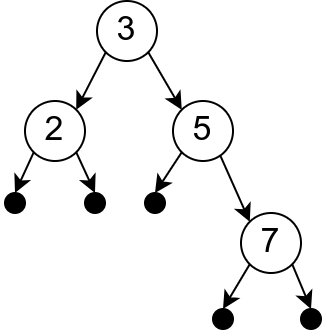

Алгебарски типови података
--------------------------

Поред имплементације алгоритама, програмирање подразумева и дефинисање
структура података. У језику Haskell постоји неколико начина да
дефинишемо нове типове података. Ми ћемо се фокусирати на **алгебарске
типове података**, који се дефинишу помоћу кључне речи ``data``.

Најједноставнија употреба алгебарских типова је дефинисање набројивих
типова. На пример,

.. code-block:: haskell

   data Color = Red | Green | Blue

Овим смо дефинисали тип ``Color`` и три константе (``Red``, ``Green``
и ``Blue``) које су овог типа.

Алгебарске типове можемо користити и за дефинисање структурних типова
података (по узору на ``struct`` у језику C#). На пример,

.. code-block:: haskell

   data Person = Person { name::String, yearOfBirth::Int }

Овим смо дефинисали тип ``Person``. Свака особа има име и годину
рођења. Уз тип смо добили и функцију (тзв. конструктор) ``Person``,
која прави податак типа ``Person`` од ниске и броја. На пример,

.. code-block:: haskell
                
   Person "Petar Petrović" 2007

је податак типа ``Person`` (немојте се збунити тиме што смо име типа и
име конструктора означили исто -- на то сте навикли и у
објектно–оријентисаним језицима). Имена поља ``name`` и
``yearOfBirth`` се могу користити за јаснију дефиницију података типа
``Person``.

.. code-block:: haskell
                
   Person {name="Petar Petrović", yearOfBirth=2007}

Имена поља су уједно функције које читају одговарајућа поља. На
пример, ``name`` је функција типа ``name :: Person -> String``.

.. code-block:: haskell
                
   Prelude> name (Person "Petar Petrović" 2007)
   "Petar Petrović"

Имена поља се могу изоставити приликом дефиниције типа:

.. code-block:: haskell

   data Person = Person String Int

Тип може имати и више конструктора. На пример, особа је или запослена
или је студент.

.. code-block:: haskell

   data Person =
      Employee {name::String, salary::Double}
    | Student {name::String, int::year}
               
Дефинисање функција над алгебарским типовима је обично засновано на
уклапању шаблона по разним конструкторима. На пример:

.. code-block::

   hello :: Person -> String
   hello (Employee name salary) = "Hello, my name is " ++ name
   hello (Student name year) = "Hello, I am " ++ show year ++ ". year student"

Приметимо да смо за конверзију године у ниску карактера морали
употребити функцију ``show``. Ова функција је дефинисана за различите
типове података (све типове који припадају класи типова ``Show``) и
служи да се они могу приказати тј. да се податак тог типа претвори у
ниску карактера којом се представља.
   
Уклапање шаблона може да се врши и у склопу израза ``case-of``. На пример:

.. code-block::
   
   personType :: Person -> String
   personType person = case person of
                         Employee _ _ -> "employee"
                         Student _ year -> show year ++ ". year student"

Наравно, исто је могло бити урађено на једноставнији начин:

.. code-block::
   
   personType :: Person -> String
   personType (Employee _ _) = "employee"
   personType (Student _ year) -> show year ++ ". year student"

Пуна снага алгебарских типова података види се у случају рекурзивних
(каже се и индуктивних) типова података. Листа је основни пример
таквог типа података. Листа је или празна или се добија надовезивањем
елемента на почетак неке листе (репа). Тип листе целих бројева би се
могао дефинисати на следећи начин:

.. code-block::

   data List =
     Empty
   | Cons Int List

Листа је или празна (конструктор ``Empty``) или се добија
надовезивањем броја на листу (конструктор ``Cons``). Пример податка
овог типа је

.. code-block::

   Cons 1 (Cons 2 (Cons 3 Empty))

којим се суштински представља листа ``[1, 2, 3]``. Функције које
обрађују индуктивне типове података обично су рекурзивне.

.. code-block::

   sum :: List -> Int
   sum Empty = 0
   sum (Cons x xs) = x + sum xs

Примећујете велику сличност са рекурзивним функцијама за обраду
уграђених листа (једина разлика је то што се тамо празна листа
обележава са ``[]`` уместо са ``Empty``, а надовезивање са ``x:xs``
уместо са ``Cons x xs``).

У наставку ћемо приказати како је коришћењем индуктивних алгебарских
типова података могуће дефинисати неколико веома корисних структура
података.
   
   
Бинарно дрво
............

Циљ нам је да направимо структуру података којом можемо да
представљамо скупове елемената тако да ефикасно можемо да убацујемо
нове елементе и да проверавамо да ли елементи припадају скупу. Једна
погодна структура података за представљање скупа је бинарно
дрво. Бинарно дрво је рекурзивна структура података која се састоји од
чворова. У чвору је уписана нека вредност (претпоставићемо,
једноставности ради, да је у питању вредност типа ``Int``), а лево и
десно се налазе мања дрвета. Излаз из ове рекурзије представља празно
дрво које нема ни вредност ни наследнике. Тип података за представљање
дрвета може бити дефинисан на следећи начин:

.. code-block:: haskell

   data Tree =
      Empty |
      Node Tree Int Tree

Дрво је, дакле, или празно (``Empty``) или је у питању чвор који
садржи три податка: лево поддрво, вредност типа ``int`` и десно
поддрво.

Сада можемо да формирамо изразе чији је тип ``Tree``. На пример

.. code-block:: haskell

   Node (Node Empty 2 Empty) 3 (Node Empty 5 (Node Empty 7 Empty))

   
Нажалост, приликом њиховог уноса у интерпретатор добићемо поруку да
систем не уме да прикаже дрво. Најједноставнији начин да се то реши је
да се аутоматски генерише функција за приказ дрвета, што се постиже
тиме што се након дефиниције типа дода ``deriving Show``.

.. code-block:: haskell

   data Tree =
      Empty |
      Node Tree Int Tree
      deriving Show

На овај начин је аутоматски дефинисана функција ``show :: Tree -> String``
која на основу датог дрвета гради ниску карактера која представља дрво
у истом формату у ком се оно може задати у програму (нпр.
``Node Empty 2 Empty``).

.. infonote::
   
   ``Show`` је заправо класа типова која садржи типове за које постоји
   функција ``show`` која може да претвори податак тог типа у
   ниску. Клаузулом ``deriving Show`` поред аутоматског генерисања
   функције ``show`` се истовремено наглашава да ће дефинисани тип
   података припадати класи ``show``. Ми се нећемо детаљније бавити
   класама типова. Покушај на интернету да пронађеш више информација о
   овој теми.

Приказани запис дрвета је релативно компликован. Једноставније би било
да, на пример, претходно дрво представимо ниском ``(.2.)3(.5(.7.))`` и
да дефинишемо функцију ``parseTree`` која од такве ниске гради дрво.
Употребићемо технику рекурзивног спуста, коју сте срели у првом
разреду. Користимо следећу контекстно-слободну граматику.

.. math::

   \begin{eqnarray*}
   \mathit{drvo} &\rightarrow& .\\
   \mathit{drvo} &\rightarrow& ( drvo\ broj\ drvo )
   \end{eqnarray*}

Пошто су изрази потпуно заграђени, на основу првог карактера
одређујемо да ли се примењује прво или друго правило. У другом правилу
прво треба да прескочимо отворену заграду, затим рекурзивно да
прочитамо лево поддрво, затим да прочитамо број, па да рекурзивно
прочитамо десно поддрво и да на крају прочитамо десну заграду. Сваки
позив функције парсирања треба да прочита садржај са почетка и да
врати прочитано дрво, али и преостали део ниске, иза прочитаног
садржаја. Стога дефинишемо помоћну функцију ``parseTree'`` која то
ради, док главна функција враћа само дрво, занемаривши преостали
садржај ниске (ако је ниска исправна, преостали садржај ће бити
празан). Наредна имплементација претпоставља да је ниска која се
парсира увек исправно задата.

.. code-block:: haskell
                
   import Data.Char (isDigit)

   parseTree :: String -> Tree
   parseTree str = fst (parseTree' str)
     where
       parseTree' :: String -> (Tree, String)
       parseTree' str =
         if head str == '.' then
           (Empty, tail str)
         else
           let str1 = tail str;                       -- skip (
               (left, str2) = parseTree' str1         -- read left subtree
               (valueStr, str3) = span isDigit str2   -- read value 
               (right, str4) = parseTree' str3        -- read right subtree
               str5 = tail str4                       -- skip )
           in (Node left (read valueStr) right, str5)
              
Обратимо пажњу на примену функције ``span isDigit``. Функција
``isDigit :: Char -> Bool`` је увезена из библиотеке ``Data.Char``
(зато је на почетку програма морала бити наведена декларација
``import``) и проверава да ли је дати карактер цифра. Функција
``span :: (a -> Bool) -> [a] -> ([a], [a])`` дели листу на два дела:
елементе са почетка листе који задовољавају услов дат као аргумент
функције ``span`` и остатак листе. Функција ``read`` чита бројевну
вредност из ниске која представља исправан запис броја.
           
За представљање скупа ми ћемо користити уређена тј. претраживачка
дрвета (енг. *binary search tree*). Њихова основна особина је да сваки
чвор задовољава да се у левом поддрвету налазе вредности које су мање
или једнаке од вредности у том чвору, а у десном поддрвету вредности
које су веће или једнаке од вредности у том чвору. Ако не желимо
дупликате (а скуп обично не садржи дупликате), онда захтевамо да важе
стриктне неједнакости (лево су строго мањи, а десно строго већи
елементи од оног уписаног у чвору). На основу овога можемо дефинисати
рекурзивну функцију за уметање елемента у дрво. Она прима дрво и
вредност која се умеће и враћа ново дрво. Приметимо да се већи део
полазног дрвета задржава, тако да овај приступ није меморијски превише
захтеван (пошто се у функционалном програмирању обично не врши
модификација података, они могу бити дељени, без копирања).

Уметање вредности у право дрво даје дрво коме је та вредност у корену,
а лево и десно су празна поддрвета.  Уметање у непразно дрво
подразумева поређење вредности ``x``, која се умеће, са вредношћу
уписаном у корен дрвета.  Ако је ``x`` мање од корена, врши се
рекурзивно убацивање у лево поддрво (вредност у корену и десно поддрво
остају неизмењени); ако је веће врши се рекурзивно убацивање у десно
поддрво (вредност у корену и лево поддрво остају неизмењени), а ако је
једнако вредности у корену, онда се цело дрво враћа неизмењено (не
желимо да убацујемо дупликате).

.. code-block:: haskell

   insert :: Tree -> Int -> Tree
   insert Empty x = Node Empty x Empty
   insert (Node left root right) x
      | x < root  =  Node (insert left x) root right
      | x > root  =  Node left root (insert right x)
      | otherwise =  Node left root right
                
Понављањем ове функције лако можемо да формирамо дрво од листе
бројева. Тај поступак можемо имплементирати кроз функцију која формира
дрво од елемената листе.

.. code-block:: haskell

   treeOfList :: [Int] -> Tree
   treeOfList = foldl insert Empty

Сложеност функције ``insert`` и ``treeOfList`` зависи од распореда
чворова дрвета. У најгорем случају, када је листа од које се формира
дрво сортирана, сви чворови ће завршити на једној страни (увек ће лево
или ће увек десно поддрво бити празно, у зависности од тога како је
листа сортирана). Тада је сложеност функције ``insert`` линеарна, а
функције ``treeOfList`` квадратна. Ипак, ако су елементи који се
убацују у дрво насумични, можемо очекивати да ће дрво бити прилично
балансирано (да ће број чворова са леве и са десне стране сваког чвора
бити отприлике једнак) и тада ће висина дрвета логаритамски зависити
од броја чворова дрвета, па ће сложеност функције ``insert`` бити
:math:`O(\log n)`, а сложеност функције ``treeOfList`` бити :math:`O(n
\log n)`.

.. infonote::

   Уместо обичних претраживачких дрвета могуће је користити и
   тзв. самобалансирајућа дрвета. Најпознатије врсте таквих дрвета су
   **АВЛ** дрвета и **Црвено-црна дрвета**. Алгоритам уметања у ова
   дрвета је такав да се приликом уметања проверава да ли је нарушена
   равнотежа између левог и десног дела и ако јесте, дрво се ротира
   тако да би се та равнотежа поново успоставила.
   
Када је формирано дрво, тада можемо вршити његову претрагу, тј. можемо
имплементирати функцију која проверава да ли дрво садржи дати елемент.
Празно дрво не садржи ниједан елемент. Непразно дрво претражујемо тако
што елемент који тражимо поредимо са вредношћу у корену. Ако је
вредност мања од корена, тражимо је рекурзивно у левом поддрвету, ако
је већа, у десном, а ако је једнака вредности у корену, онда знамо да
дрво садржи тражену вредност.

.. code-block:: haskell

   contains :: Tree -> Int -> Bool
   contains Empty x = False
   contains (Node left root right) x
     | x < root    = contains left x
     | x > root    = contains right x
     | otherwise   = True

.. infonote::     

   Ово је вероватно добар тренутак да упоредимо приказано решење у
   језику Haskell са решењем у традиционалном императивном програмском
   језику, какав је C.

   .. code-block:: c

      #include <stdio.h>
      #include <stdlib.h>

      struct Node {
         int value;
         struct Node *left, *right;
      };

      Node* newNode(int value) {
            Node* new = (Node*)malloc(sizeof(Node));
            new->value = value;
            new->left = new->rigth = NULL;
      }

      void freeNode(Node* node) {
         if (node != NULL) {
            freeNode(node->left);
            freeNode(node->right);
            free(node);
         }
      }

      Node* insert(Node* root, int value) {
         if (root == NULL)
            return newNode(value);
         if (value < root->value)
            root->left == insert(root->left, value);
         else if (value > root->value)
            root->right = insert(root->right, value);
         return root;
      }

      int contains(Node* root, int value) {
         if (root == NULL)
            return 0;
         if (value < root->value)
            return contains(root->left, value);
         else if (value > root->value)
            return contains(root->right, value);
         else
            return 1;
      }

      Node* treeOfArray(int[] a, int n) {
          Node* root = NULL;
          for (int i = 0; i < n; i++)
             root = insert(root, a[i]);
          return root;
      }

      void printTree(Node* root) {
         if (root != NULL) {
             printTree(root->left)
             printf("%d ", root->value);
             printTree(root->right);
         }
      }

      int main() {
          int a = {1, 3, 2, 5, 4};
          int n = sizeof(a) / sizeof(int);
          Node* root = treeOfArray(a, n);
          printTree(root);
          freeNode(root);
      }

   Примећујемо да су алгоритми који се користе исти као у
   одговарајућим Hakell функцијама, али да је кôд оптерећен многим
   техничким детаљима о којима није било потребе водити рачуна у
   Haskell имплементацији. На пример, у језику C је било потребно
   ручно алоцирати и ослобађати меморију (коришћењем библиотечких
   функција ``malloc`` и ``free``). Употреба показивача је
   експлицитна, што на многим местима чини да је кôд оптерећен
   додатним симболима (попут ``*``, ``->``) и програм је теже и писати
   и разумети. Захваљујући библиотечкој функцији ``fold``,
   имплементација креирања дрвета од листе је много краћа и
   једноставнија од имплементације у C-у која мора да користи петљу и
   да ручно имплементира функционалност коју нам пружа ``fold``.
   
У уређеном дрвету је лако пронаћи минимални и максимални елемент (они
се налазе у крајњем левом и крајњем десном чвору).

.. code-block:: haskell

   minTree :: Tree -> Int
   minTree (Node Empty x _) = x
   minTree (Node left x _ ) = minTree left

Дефинишимо и функцију која уклања тај најмањи елемент дрвета (под
претпоставком да је дрво непразно). Функција враћа уређени пар, који
се састоји од уклоњене вредности и измењеног дрвета. Ако не постоји
лево поддрво корен дрвета је најмањи елемент, а његовим брисањем
остаје само десно поддрво. У супротном бришемо најмањи елемент левог
поддрвета.

.. code-block:: haskell

   deleteMin :: Tree -> (Int, Tree)
   deleteMin (Node Empty x right) = (x, right)
   deleteMin (Node left x right)  = let (m, left') = deleteMin left
                                     in (m, Node left' x right)
            
Ова се функција може искористити и за уклањање дате вредности из скупа
(тј. дрвета). Брисањем било чега из празног дрвета дрво остаје празно.
Ако је дрво непразно, а вредност која се брише мања од корена,
рекурзивно се та вредност брише из левог поддрвета. Ако је вредност
већа од корена, рекурзивно се та вредност брише из десног поддрвета.
Најкомпликованији је случај када је вредност која се брише једнака
вредности у корену. Ако је тада десно поддрво празно, можемо само
вратити лево поддрво. У супротном можемо обрисати најмању вредност из
десног поддрвета и њу ставити на место корена (аналогно бисмо могли
обрисати највећу вредност из левог поддрвета и њу ставити на место
корена). Да бисмо анализирали да ли је десно поддрво празно или
непразно, можемо употребити израз ``case-of``.

.. code-block:: haskell

   delete :: Int -> Tree -> Tree
   delete _ Empty = Empty
   delete x' (Node left x right)
      | x' < x      = Node (delete x' left) x right
      | x' > x      = Node left x (delete x' right)
      | otherwise   = case r of Empty -> left
                                _     -> let (m, right') = deleteMin right
                                          in Node left m right'

                                     
Од елемената дрвета можемо формирати листу. Ако прво покупимо елементе
из левог поддрвета, затим корен, па затим елементе из десног
поддрвета, захваљујући уређености дрвета добијена листа ће бити
сортирана. На тај начин добијамо још један алгоритам сортирања
(енг. *tree sort*).

.. code-block:: haskell

   listOfTree :: Tree -> [Int]
   listOfTree Empty = []
   listOfTree (Node left root right) =
      listOfTree left ++ [root] ++ listOfTree right

   treeSort :: [Int] -> [Int]
      treeSort = listOfTree . treeOfList

      
У дрвету које смо дефинисали налазе се увек подаци типа ``Int``,
међутим, јасно је да би се на исти начин могли чувати и подаци других
типова. Могуће је дефинисати и дрво којем је тип података записаних у
чвору параметар (навикли сте на овакве „генеричке“ типове у језику C#
где сте користили типове попут ``List<int>`` где је тип елемената
колекције задат као параметарски тип те колекције).

.. code-block:: haskell

   data Tree a =
      Empty
    | Node (Tree a) a (Tree a)
   deriving Show

У овом случају тип означен са ``a`` је параметар типа дрво. Дрво
садржи лево и десно поддрво (која такође имају елементе типа ``a``) и
вредност типа ``a``.

Да бисмо могли формирати претраживачко дрво, тип ``a`` мора да подржи
поређење елемената, тј. мора бити класе ``Ord``.

.. code-block:: haskell

   insert :: Ord a => Tree a -> a -> Tree a
   insert Empty x = Node Empty x Empty
   insert (Node left root right) x
      | x < root  =  Node (insert left x) root right
      | x > root  =  Node left root (insert right x)
      | otherwise =  Node left root right

Ред
...

Листа једноставно може да се користи као стек. Елементи могу да се
додају са почетка и скидају са почетка листе у линеарној сложености.
Међутим, ред је мало компликованије имплементирати (наравно, постоје
библиотечке имплементације, али ћемо га овде, вежбе ради,
имплементирати ручно).

Додавање елемената на крај листе има линеарну сложеност, па ред није
добро имплементирати помоћу листе. Уобичајени начин имплементације
реда у функционалним језицима је тзв. **амортизовани ред**
(енг. *amortized queue*) који се састоји од две листе.

.. code-block:: haskell
                
   data Queue a = Queue [a] [a]

У празном реду су обе листе празне.
   
.. code-block:: haskell

   emptyQueue :: Queue a
   emptyQueue = Queue [] []
   
Елементи се увек додају на почетак прве листе, а скидају са почетка друге.

Операцију додавања елемента у ред је тривијално имплементирати.

.. code-block:: haskell
                
   push :: a -> Queue a -> Queue a
   push x (Queue left right) = Queue (x : left) right

Уклањање елемента из реда је мало компликованије. Функцију ћемо
дефинисати тако да врати уклоњени елемент и нови ред. Пошто уклањање
из празног реда није могуће, потребно је да се некако у повратној
вредности укључи и могућност да је враћена вредност са почетка реда,
али и да уклањање није успело. Програмски језици углавном ово решавају
тако што типове проширују специјалном вредношћу ``null`` која означава
да операција није успешно извршена. У функционалним језицима се обично
користи посебан тип ``Maybe`` који омоћава разликовање исправних и
недостајућих вредности.

.. infonote::
   
   Тип ``Maybe a`` омогућава представљање **опционих вредности** типа
   ``a``. Конструктор ``Nothing`` означава недостајућу вредност, а
   ``Just`` нормалну вредност. На пример, ``Just 3`` је податак типа
   ``Maybe Int``. Овај тип се често користи да означи повратне
   вредности функција које из неког разлога некада не могу да врате
   исправну вредност.  На пример, ако функција успе и треба да врати
   вредност ``3``, она ће вратити вредност ``Just 3``, а ако не успе,
   вратиће вредност ``Nothing`` (ово одговара вредности ``null`` у
   програмском језику C#, која служи да означи недостатак исправне
   вредности).

   Предност коришћења посебног у односу на специјалну вредност
   ``null`` је то што је једини начин да се до исправне вредности дође
   тај да се експлицитно испита да ли је вредност исправна. Ово се
   обично имплементира или поклапањем шаблона или изразом ``case``.

   .. code-block::

      g x = case f x of 
               Nothing -> -1
               Just value -> value

Пошто није могуће скидање вредности из празног реда, Уместо да
функција ``pop`` враћа пар типа ``(a, Queue a)``, она ће враћати пар
типа ``(Maybe a, Queue a)``.

Aко је цео ред празан, наша функција ``pop`` враћа ``Nothing`` и
празан ред. Ако десна листа није празна, враћамо њен први елемент
(упакован у конструктор ``Just``), док ред мењамо тако да му лева
листа остаје неизмењена, а десна скраћена за њен почетни елемент. Ако
је само десна листа празна, тада обрћемо леву листу и пребацујемо је
на десну страну и затим уклањамо први елемент тако добијене листе.

.. code-block:: haskell
                
   pop :: Queue a -> (Maybe a, Queue a)
   pop (Queue [] []) = (Nothing, Queue [] [])
   pop (Queue left (x:xs)) = (Just x, Queue left xs)
   pop (Queue left []) = let x:xs = reverse left
                          in (Just x, Queue [] xs)

Сложеност најгорег случаја операције ``pop`` је линеарна, јер је
функција ``reverse`` линеарне сложености. Ипак, након једног
пребацивања елемената са леве на десну страну, много наредних
операција ``pop`` ће бити могуће извршити веома брзо. Ако анализирамо
пут сваког елемента кроз ред, видимо да ће он једном бити додат на
почетак леве листе, једном бити склоњен са почетка леве и додат на
почетак десне листе (ово се догађа током извршавања функције
``reverse``) и на крају једном скинут са десне листе. Дакле, сваки
елемент учествује у тачно четири операције константне сложености, па
се :math:`n` елемената реда може обрадити у сложености :math:`O(n)`,
што значи да операције додавања и уклањања елемената имају константну
амортизовану сложеност.

Да бисмо могли да експериментишемо са овом структуром података,
пожељно је да можемо да је испишемо. Аутоматски генерисана функција
исписа (коју можемо добити ако након дефиниције типа ставимо
``deriving Show``) приказује интерну репрезентацију података
тј. садржај обе листе.

Ако желимо да прикажемо садржај елемената реда у једној листи (дакле,
онако како га замишљамо, а не како је имплементиран), можемо
дефинисати своју функцију приказа у облику ниске карактера. То можемо
урадити на следећи начин.

.. code-block:: haskell

   show :: Queue a -> String
   show (Queue left right) = show (right ++ reverse left)
      
Ниску добијамо тако што спојимо десну и обрнуту леву листу (тиме је
елемент који је први на реду за скидање приказан на
почетку). Приметите да ту листу претварамо у ниску позивом функције
``show``, међутим, ово није рекурзивни позив јер је позвана функција
``show`` другог типа (она претвара листу, а не ред у ниску карактера).

.. infonote::

   Претходна функција ``show`` се користи када је корисник експлицитно
   позове, али неће бити позивана аутоматски када год је потребно да
   се неки ред прикаже на екрану. Да би се то постигло, морамо да
   користимо механизам класа типова тј. да нагласимо да наш тип
   ``Queue`` припада класи типова ``Show``, при чему се за приказ не
   користи аутоматски генерисана функција (добијена клаузулом
   ``deriving Show``), већ специфична функција коју ми дефинишемо.  Да
   би се то урадило, користи се клаузула ``instance``.

   .. code-block:: haskell
                   
      instance Show a => Show (Queue a) where
         show :: Queue a -> String
         show (Queue left right) = show (right ++ reverse left)
    
   Овим смо рекли да тип ``Queue a`` припада класи типова ``Show``
   тј. може да се прикаже (део ``Show (Queue a)``), међутим, то важи
   само под условом да тип ``а`` припада класи ``Show`` тј. може да се
   прикаже (део ``Show a =>``). Затим дефинишемо функцију ``show``
   која дати ред представља у облику ниске карактера.

   
Вежба -- алгебарски типови података
...................................

Као вежбу алгебарских типова података имплементирајмо структуру
података *речник*.

.. questionnote::

   Дефинисати тип података за представљање речника (мапе) елемената
   типа ``k`` у елементе типа ``v``. Речник треба да буде реализован
   помоћу уређеног бинарног дрвета.
      
.. code-block:: haskell

   data Map k v =  Null
                 | Node k v (Map k v) (Map k v)
                 deriving Show

.. questionnote::

   Дефинисати функцију која проверава да ли је речник празан.
   
.. code-block:: haskell
                
   empty :: Map k v -> Bool
   empty Null = True
   empty _    = False

.. questionnote::

   Дефинисати функције за уметање тј. ажурирање вредности у речнику.
   
   - Дефинисати прво функцију ``insertWithKey`` која датом кључу
     придружује дату вредност ако тај кључ већ не постоји у речнику, а
     ако постоји онда му придружује нову вредност применом задате
     функције на тај кључ, стару вредност и нову вредност.

   - Коришћењем претходне функције дефинисати затим функцију
     ``insert``, која датом кључу придружује дату вредност (ако кључ
     већ постоји у речнику, стара вредност се занемарује).

   
   
.. code-block:: haskell
                
   insertWithKey :: Ord k => (k -> v -> v -> v) -> k -> v -> Map k v -> Map k v
   insertWithKey f k v Null = Node k v Null Null
   insertWithKey f k v (Node k' v' l r)
     | k < k'   = Node k' v' (insertWithKey f k v l) r
     | k > k'   = Node k' v' l (insertWithKey f k v r)
     | k == k'  = Node k' (f k v' v) l r
    
   insert :: Ord k => k -> v -> Map k v -> Map k v
   insert = insertWith (\ v v' -> v')

.. questionnote::

   Дефинисати функцију која листу парова (кључ, вредност) претвара у
   речник.
   
.. code-block:: haskell
                
   fromList :: Ord k => [(k, v)] -> Map k v
   fromList = foldl (\m (k, v) -> insert k v m) Null 

.. questionnote::

   Дефинисати функцију ``find``, која проналази вредност придружену
   датом кључу у речнику. Резултат треба да буде типа ``Maybe v``, што
   значи да треба да буде ``Nothing`` ако кључ не постоји у речнику,
   односно ``Just v`` ako je кључу придружена вредност ``v``.

   Коришћењем функције ``find`` дефинисати функцију
   ``findWithDefault``, која враћа вредност придружену датом кључу или
   задату подразумевану вредност ако кључ не постоји у речнику.

   Коришћењем функције ``find`` дефинисати функцију ``containsKey``,
   која за дату мапу враћа функцију која проверава да ли кључ постоји
   у речнику.

   
.. code-block:: haskell
                
   find :: Ord k => Map k v -> k -> Maybe v
   find Null _ = Nothing
   find (Node k v l r) k'
     | k' < k  = find l k'
     | k' > k  = find r k'
     | k' == k = Just v

   findWithDefault :: Ord k => v -> k -> Map k v -> v
   findWithDefault dflt k m = case find m k of Nothing -> dflt
                                               Just v -> v

   containsKey :: Ord k => Map k v -> (k -> Bool)
   containsKey m k = case search m k of Nothing -> False
                                        Just _ -> True

.. questionnote::

   Дефинисати функцију ``adjustWithKey`` која мења вредност датом
   кључу тако што нову вредност одређује применом дате функције на
   кључ и стару вредност.

.. code-block:: haskell
    
   adjustWithKey :: Ord k => (k -> v -> v) -> k -> Map k v -> Map k v
   adjustWithKey f k Null = Null
   adjustWithKey f k (Node k' v' l r)
     | k < k'   = Node k' v' (adjustWithKey f k l) r
     | k > k'   = Node k' v' l (adjustWithKey f k r)
     | k == k'  = Node k' (f k v') l r
    
    
.. questionnote::

   Дефинисати функцију која уклања најмањи кључ из речника.

   Дефинисати затим функцију која уклања дати кључ из речника.

.. code-block:: haskell                                      
    
   deleteMin :: Map k v -> ((k, v), Map k v)
   deleteMin (Node k v Null r) = ((k, v), r)
   deleteMin (Node k v l r) = let ((k', v'), d) = deleteMin l
                               in ((k', v'), Node k v d r)
    
   delete :: Ord k => k -> Map k v -> Map k v
   delete k Null = Null
   delete k (Node k' v' l r)
    | k < k'  = Node k' v' (delete k l) r
    | k > k'  = Node k' v' l (delete k r)
    | k == k' = case r of Null -> l
                          _    -> let ((k', v'), d) = deleteMin r
                                   in Node k' v' l d

.. questionnote::

   Дефинисати функционал ``fold`` за речник. Он као први аргумент
   прима функцију која на основу претходног резултата, кључа и
   вредности придружене кључу ажурира резултат, као други аргумент
   прима почетну вредност резултата, а као трећи аргумент прима
   речник.

   Коришћењем тако дефинисаног функционала ``fold`` дефинисати
   функцију ``size``, која израчунава величину речника (број кључева у
   речнику), затим функцију ``toList``, која креира листу парова (кључ,
   вредност) из речника, сортирану по кључевима и на крају функцију
   ``union`` која прави унију два речника (ако кључ постоји у оба
   речника потребно је придружити му вредност из другог).

                                   
.. code-block:: haskell

   foldMap :: (a -> k -> v -> a) -> a -> Map k v -> a
   foldMap _ i Null = i
   foldMap f i (Node k v l r) =
     foldlMap f (f (foldlMap f i l) k v) r
    
   size :: Map k v -> Int
   size = foldMap (\ a k v -> a + 1) 0
    
   toList :: Ord k => Map k v -> [(k, v)]
   toList = reverse . foldlMap (\ a k v -> (k, v) : a) []
    
   union :: Ord k => Map k v -> Map k v -> Map k v
   union m1 m2 = foldlMap (\ a k v -> insert k v a) m1 m2 
