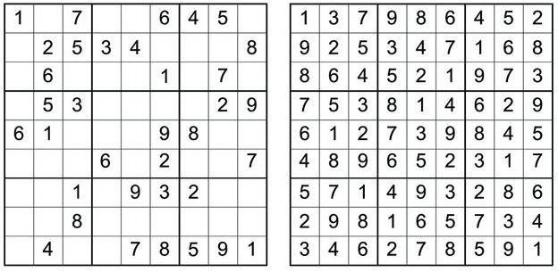

Пример сложенијег програма
--------------------------

Као пример сложенијег програма приказаћемо програм за решавање
загонетке Судоку. Задатак је да се табла димензије :math:`9 \times 9`
попуни цифрама од 1 до 9 тако да су цифре у свакој врсти, свакој
колони и сваком од 9 квадрата димензије :math:`3 \times 3` буду
различити. Обично се креће од поља на ком се већ налазе неки бројеви
циљ је попунити сва остала поља. Један пример делимично попуњенe
Судоку табле и коначног решења је дат на наредној слици.

           
Иако је оригинална загонетка димензије :math:`9 \times 9`, она
теоријски може бити било које димензије :math:`d^2 \times d^2` (у
оригиналној варијанти је :math:`d=3`). Стога ћемо увести константу
``dim`` која одређује димензију табле.

.. code-block:: haskell

   dim = 3

Пређимо сада на дефинисање основних типова. Таблу ћемо представити као
матрицу тј. листу листи које садрже бројеве, при чему ћемо бројеве,
једноставности ради, представити типом ``Int``.  Пошто су бројеви од 0
до :math:`d^2`, могао би бити коришћен и неки ужи тип. Празна поља
ћемо означавати бројем 0 (уместо овога могао би бити коришћен тип
``Maybe Int``, који, подсетимо се, омогућава представљање опционих
вредности). Декларацијом ``type`` дефинишемо нови тип тако што дајемо
ново име постојећем типу.

.. code-block:: haskell
   
   type Broj = Int
   type Tabla = [[Broj]]

Важно је да умемо да за дату таблу прочитамо сваку појединачну врсту,
сваку колону и сваки квадрат димензије :math:`d \times
d`.

Претпостављаћемо да је наша табла представљена листом својих врста, па
је врсту тривијално прочитати (само читамо листу на датој позицији
унутар наше листе листи, при чему су врсте нумерисане бројевима од 0
до :math:`d^2 - 1`).

Што се тиче колоне, она се добија тако што се из сваке врсте издвоји
елемент на датој позицији. Ово се елегантно може реализовати применом
пресликавања тј. функције ``map``.  Квадрате нумеришемо бројевима од 0
до :math:`d^2-1` одозго наниже, слева надесно. Сваком квадрату могу
бити придружене две координате од 0 до :math:`d-1` које се одређују
као целобројни количник и остатак при дељењу редног броја квадрата
бројем :math:`d`. Множењем тих координата са :math:`d` добијају се
координате горњег левог поља у квадрату. Квадрат онда издвајамо тако
што прво издвојимо :math:`d` врста кренувши од врсте у којој се налази
горње лево поље квадрата, затим из тих врста издвојимо :math:`d`
колона кренувши од колоне у којој се налази горње лево поље квадрата и
на крају добијену листу листи димензије :math:`d\times d` спојимо у
једну листу која садржи :math:`d^2` елемената (то можемо урадити
библиотечком функцијом ``concat``).
   
.. code-block:: haskell
   
   vrsta :: Tabla -> Int -> [Broj]
   vrsta tabla v = tabla !! v
    
   kolona :: Tabla -> Int -> [Broj]
   kolona tabla k = map (\ vrsta -> vrsta !! k) tabla
    
   kvadrat :: Tabla -> Int -> [Broj]
   kvadrat tabla kv =
     let v = kv `div` dim;
         k = kv `mod` dim
         vrste = map (vrsta tabla) [dim*v..dim*v+dim-1]
         kolone = map (kolona vrste) [dim*k..dim*k+dim-1]
       in concat kolone

Сада можемо да пређемо на основни алгоритам претраге са повратком.
Алгоритам ће бити реализован кроз функцију

.. code-block:: haskell
                
   popuni :: Tabla -> [Tabla]

која добија делимично попуњену таблу и враћа све исправно попуњене
табле које се од ње могу добити. Током претраге ћемо попуњавати једно
по једно празно поље и то на све могуће исправне начине. Стога ћемо
дефинисати рекурзивну функцију

.. code-block:: haskell
                
   popuniPolje :: Tabla -> Polje -> [Tabla]

која прима делимично попуњену таблу и координате неког поља на њој и
затим попуњава то поље на све могуће начине и наставља попуњавање
рекурзивно од следећег поља све док се не попуни цела табла. Поља су
суштински представљена као уређени парови координата, међутим, да
бисмо добили читљивији код увешћемо посебан тип.
       
.. code-block:: haskell
       
   newtype Polje = Polje (Int, Int)

Након попуњавања текућег поља прелазићемо на попуњавање следећег поља
и стога дефинишемо функцију која проналази следеће на основу датог
текућег поља (она увећава колону за један, а ако се тиме добије
координата колоне која је ван опсега, увећава врсту за један).
Претрага ће се завршавати када следеће поље не постоји, па стога
дефинишемо и помоћну функцију којом проверавамо да ли је добијено
следеће поље исправно.
   
.. code-block:: haskell
   
   sledece :: Polje -> Polje
   sledece (Polje (v, k)) = if k + 1 < dim*dim
                            then Polje (v, k+1)
                            else Polje (v+1, 0)
   
   ispravno :: Polje -> Bool
   ispravno (Polje (v, k)) = v < dim*dim && k < dim*dim
    

Дефинишимо сада функције за читање броја са датог поља и упис броја на
дато поље. Операција измене елемента на датој позицији у листи није
карактеристична за функционално програмирање (јер је линеарне
сложености, па је веома неефикасна). Уместо листа постоји могућност
коришћења других структура података које омогућавају ефикасну измену
елемента на датој позицији (наравно, измена није у месту већ се враћа
измењена структура података, док оригинална остаје непромењена),
међутим, пошто су наше листе кратке, ми ћемо се задржати на листама.

Дефинишимо прво функцију која враћа листу која се добија изменом
полазне листе тако што се на дату позицију упише дата вредност. Њу је
веома лако дефинисати помоћу функција ``take`` која узима дати број
елемената са почетка листе, ``drop`` која избацује дати број елемената
са почетка листе и оператора ``++`` који надовезује листе.
   
.. code-block:: haskell
    
   upisi :: [a] -> Int -> a -> [a]
   upisi xs i v = take i xs ++ [v] ++ drop (i+1) xs
    

Сада лако можемо дефинисати функције за читање и упис броја. Упис
вршимо тако што у полазну таблу на позицију ``v`` упишемо врсту која
се добија када се у врсту на позицији ``v`` у полазној табли, на
позицију ``k`` упише жељени број.
   
.. code-block:: haskell
                
   brojNaPolju :: Tabla -> Polje -> Broj
   brojNaPolju tabla (Polje (v, k)) = tabla !! v !! k
    
   upisiBroj :: Tabla -> Polje -> Broj -> Tabla
   upisiBroj tabla (Polje (v, k)) p = upisi tabla v (upisi (vrsta tabla v) k p)

У главној функцији претраге на текуће поље треба да упишемо све могуће
исправне вредности. Ако је број на том пољу различит од нуле, он мора
остати такав и претрага се наставља од наредног поља. Ако на пољу пише
нула, која означава да је поље празно, тада за све бројеве од 1 до
:math:`d` треба испитати да ли је могуће уписати их на то поље. То је
могуће ако се у врсти у којој се налази то поље, у колони у којој се
налази то поље и у квадрату у ком се налази то поље већ не налази тај
број. За дато поље познати су редни број врсте и колоне у којој се оно
налази, а дефинисаћемо помоћну функцију која израчунава редни број
квадрата у ком се то поље налази, а затим коришћењем раније дефинисане
функције ``kvadrat`` одређује и бројеве уписане у тај квадрат.
   
.. code-block:: haskell
   
   kvadratOko :: Tabla -> Polje -> [Broj]
   kvadratOko tabla (Polje (v, k)) =
     let vv = v `div` dim;
         kk = k `div` dim
      in kvadrat tabla (dim*vv + kk)

Провера да ли се број може уписати у квадрат се сада своди на проверу
елемената врсте, колоне и квадрата.
      
.. code-block:: haskell
      
   mozeSeUpisati :: Tabla -> Polje -> Broj -> Bool
   mozeSeUpisati tabla (Polje (v, k)) broj =
     broj `notElem` (vrsta tabla v) &&
     broj `notElem` (kolona tabla k) &&
     broj `notElem` (kvadratOko tabla (Polje (v, k)))

На крају можемо дефинисати и централну функцију која врши бектрекинг
претрагу. Прокоментаришимо функцију ``popuniPolje``. Ако поље које
треба попунити није исправно, тј. излази ван граница табле, то значи
да се стигло до краја, да је цела табла исправно попуњена и стога је
она једино своје исправно проширење. У супротном, ако је на датом пољу
већ уписана нека вредност, рекурзивно се прелази на попуњавање
следећег поља. У супротном одређујемо прво низ ``brojevi`` који садржи
све бројеве од 1 до :math:`d^2` који се могу уписати на текуће поље
тако да табла и даље остане исправна, затим се одређује низ ``table``
који садржи табле које се добијају уписом тих бројева на текуће поље,
затим се за сваку тако добијену таблу рекурзивно одређују сва исправна
проширења до потпуно попуњене табле (добија се листа табли) и на крају
се све тако добијене табле спајају у једну листу. Приметимо да користимо
функцију ``concatMap`` која спаја функционалност функције
``map (popuniPolje (sledece polje)) table`` којом покрећемо рекурзивно
претрагу за сваку таблу из листе ``table`` и ``concat`` која спаја добијену
листу листи у јединствену листу.

.. code-block:: haskell

   popuni :: Tabla -> [Tabla]
   popuni tabla = popuniPolje (Polje (0, 0)) tabla
       where popuniPolje :: Polje -> Tabla -> [Tabla]
             popuniPolje polje tabla =
               if not (ispravno polje) then [tabla]
               else if brojNaPolju tabla polje /= 0 then
                 popuniPolje (sledece polje) tabla
               else
                 let
                   brojevi = filter (mozeSeUpisati tabla polje) [1..dim*dim];
                   table = map (upisiBroj tabla polje) brojevi
                 in
                   concatMap (popuniPolje (sledece polje)) table

На крају програм можемо тестирати на конкретним примерима.
                   
.. code-block:: haskell

   sudoku :: Tabla
   sudoku=[[5,3,0,0,7,0,0,0,0],
           [6,0,0,1,9,5,0,0,0],
           [0,9,8,0,0,0,0,6,0],
           [8,0,0,0,6,0,0,0,3],
           [4,0,0,8,0,3,0,0,1],
           [7,0,0,0,2,0,0,0,6],
           [0,6,0,0,0,0,2,8,0],
           [0,0,0,4,1,9,0,0,5],
           [0,0,0,0,8,0,0,7,9]]
          
Може се приметити да иако нису вршене никакве специфичне оптимизације,
програм сасвим ефикасно ради за све табле димензије :math:`3 \times
3`. Позив

.. code-block:: haskell

   >> popuni sudoku

даје резултат

::

   [[[5,3,4,6,7,8,9,1,2],
     [6,7,2,1,9,5,3,4,8],
     [1,9,8,3,4,2,5,6,7],
     [8,5,9,7,6,1,4,2,3],
     [4,2,6,8,5,3,7,9,1],
     [7,1,3,9,2,4,8,5,6],
     [9,6,1,5,3,7,2,8,4],
     [2,8,7,4,1,9,6,3,5],
     [3,4,5,2,8,6,1,7,9]]]

што значи да постоји само један начин да се полазни проблем реши (по
правилима Судоку, загонетке се конструишу тако да имају јединствено
решење).
           
