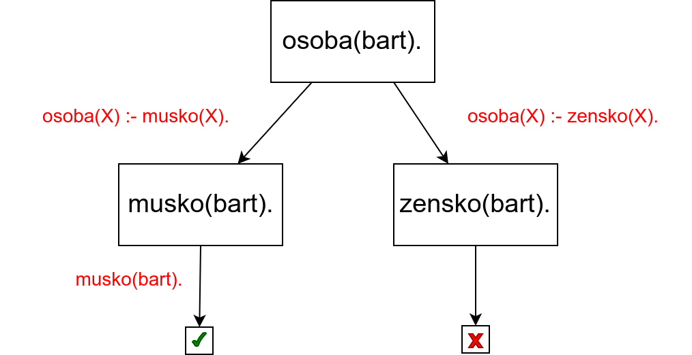
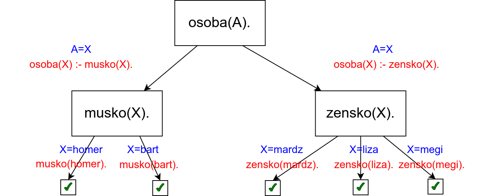
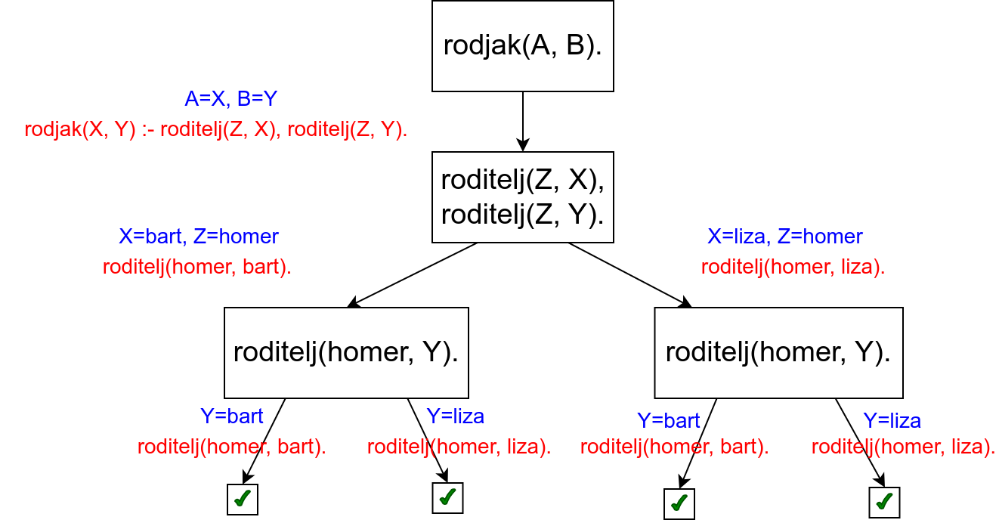
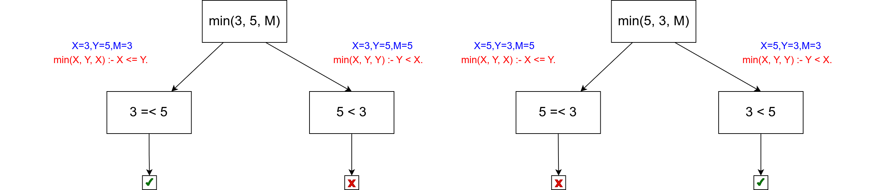
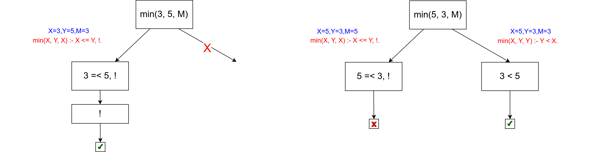
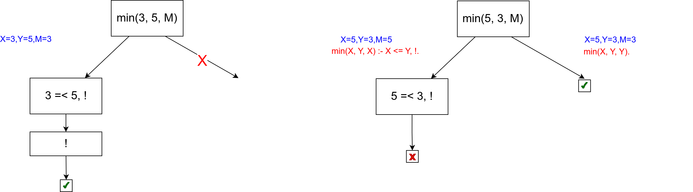
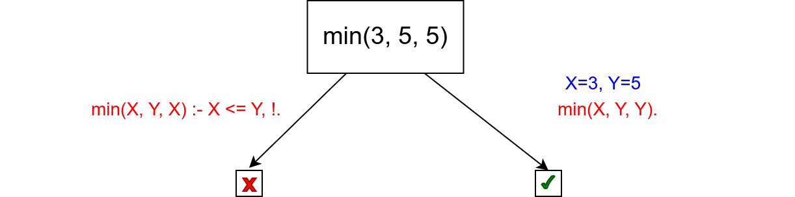
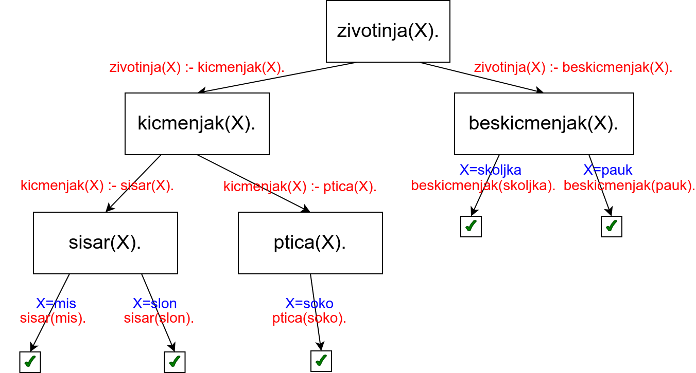
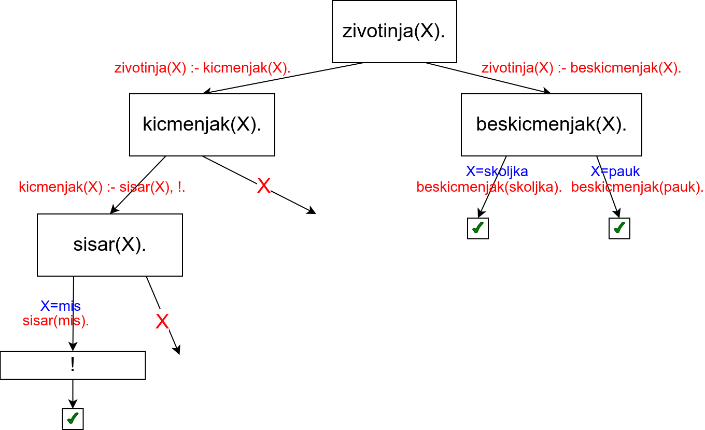

Дрво извођења
-------------

Задатак програмера је да кроз базу знања опише чињенице и правила
закључивања, а задатак Prolog система је да провери да ли је дати упит
логичка последица базе знања. Иако програмер не би требало да води
рачуна о томе како се та провера врши (рекли смо да се у основи крије
механизам резолуције), често се ипак тај механизам представља дрветом
које помаже да се разуме шта се у позадини дешава.

Постоје разни начин да се дрво извођења прикаже. Један начин је дрво
које садржи сва решења упита. Оно може да се нацрта на основу следећих
правила.

Размотримо неколико примера над следећом базом знања.

.. code-block:: prolog

   musko(homer).
   musko(bart).
   zensko(mardz).
   zensko(liza).
   zensko(meri).
   roditelj(homer, bart).
   roditelj(homer, liza).
   osoba(X) :- musko(X).
   osoba(X) :- zensko(X).
   rodjak(X, Y) :- roditelj(Z, X), roditelj(Z, Y).

Наредно дрво описује израчунавање резултата  упита ``osoba(bart).``

           
У корену дрвета се налази упит. Пошто постоје две дефиниције за
предикат ``osoba``, корен има два наследника. Са леве се на основу
правила ``osoba(X) :- musko(X).`` добија нови упит ``musko(bart)``
(јер је ``X`` унификовано са ``bart``), а са десне се на основу
правила ``osoba(X) :- zensko(X).`` добија нови упит ``zensko(bart)``
(јер је ``X`` унификовано са ``bart``). На основу чињеница у бази
знања први упит успева, а други не успева. Дакле, видимо да је овај
упит произвео једно решење и одговор је ``true``.

Наредно дрво описује израчунавање резултата упита ``osoba(A).``.

           
На дрвету се види да постоји 5 различитих решења. У корену дрвета се
налази упит ``osoba(X)``. Пошто постоје две дефиниције за предикат
``osoba``, корен има два наследника. Са леве се на основу правила
``osoba(X) :- musko(X).`` добија нови упит ``musko(X)`` (при чему се
нотира да је ``A`` унификовано са ``X``), а са десне се на основу
правила ``osoba(X) :- zensko(X).`` добија нови упит ``zensko(X)`` (при
чему се нотира да је ``A`` унификовано са ``X``). Пошто у бази постоје
две дефиниције за предикат ``musko``, чвор ``musko(X)`` има два
наследника. Оба су успешна, при чему се за први нотира да је ``X``
унификовано са ``homer``, а за други da je ``X`` унификовано са
``bart``. Када се дође до успешног чвора пријављује се решење. На
пример, код првог успешног чвора нотирано да је ``A`` унификовано са
``X``, а да је ``X`` унификовано са ``homer``, па се може дати решење
``A=homer``. Слично се дешава и у остатку дрвета.

Наредно дрво описује израчунавање резултата упита ``rodjak(A, B).``

У корену дрвета се налази упит. Пошто постоји само једно правило на
основу ког је дефинисан предикат ``rodjak``, корен има само једног
наследника. Бележи се унификатор ``A=X``, ``B=Y``, а у новом чвору се
налази десна страна правила ``roditelj(Z, X), roditelj(Z, Y)``. Први
пут имамо пример упита који је конјункција тј. који садржи два
предиката који морају бити задовољени. Они се обрађују један по један.
Прво се посматра предикат ``roditelj(Z, X)``. Пошто постоје две
дефиниције за предикат ``roditelj``, овај чвор ће имати два
наследника. Први одговара дефиницији ``roditelj(homer, bart)``. Бележи
се унификатор ``Z=homer`` и ``X=bart``. Пошто је упит био конјункција,
није довољно да буде задовољен само први предикат, већ се прелази на
наредни. Зато се као дете чвора ``roditelj(Z, X)`` додаје чвор
``roditelj(homer, Y)``. Он потиче од предиката ``roditelj(Z, Y)``,
међутим, пошто је направљена унификатор ``Z=homer``, променљива ``Z``
је замењена константом ``homer``. Пошто постоје две дефиниције за
предикат родитељ, овај чвор има два наследника. У провм се налази
успешно решење уз унификатор ``Y=bart``. Дуж пута од корена до тог
чвора забележен је унификатор ``A=X, B=Y, X=bart, Z=homer, Y=bart``,
па се пријављује решење ``A=bart``, ``B=bart``. Мало необично, али из
дате базе знања и правила закључивања заиста следи да је Барт сам свој
рођак. У другом случају се налази успешно решење уз инфикатор
``Y=liza``, одакле следи да су Барт и Лиза рођаци. Десна страна дрвета
је аналогна левој.
           

Сечење (рез)
------------

У циљу смањења простора претраге, спречавања нежељеног бектрекинга и
на тај начин изостављања неких нетачних одговора или оптимизације
времена извршавања Prolog уводи **оператор сечења** или **рез**
(енг. *cut*). Оператор сечења је често нужно примењивати да би се
добили довољно ефикасни програми. Нажалост, применом реза нарушава се
јасна логичка структура Prolog програма и разумевање њиховог значења
престаје да буде засновано на примени чистих логичких закона и правила
извођења, већ је приликом анализе програма потребно узети у обзир
механизам израчунавања (рез се најбоље разуме тако што се прати његов
ефекат на стабло израчунавања), што је много компликованије. Дакле,
рез се слободно може посматрати као још једна слаба тачка језика
Prolog – поред све теорије на којој се заснива логичка парадигма,
нелогички елемент као што је рез постаје кључан за ефикасно решавање
проблема употребом логичке парадигме!

Рез се означава са ``!``, увек успева (када се наведе у правилу,
сматра се да је резултат његовог израчунавања тачан), али у повратку
спречава бектрекинг и враћање преко њега здесна налево. Размотримо
неколико примера.

Максимум се може дефинисати на следећи начин (релацијски оператори
``=<`` и ``<``, наравно, представљају релације *мање једнако* и *мање*
и детаљније су описане у поглављу о аритметици).

.. code-block:: prolog

   min(X, Y, X) :- X =< Y.
   min(X, Y, Y) :- Y < X.

Израчунавање резултата упита ``max(3, 5, M).`` и упита ``max(5, 3,
M).`` су представљени следећим дрветима израчунавања.

   

Ако се на основу првог правила одреди да је ``X =< Y`` (што се дешава
приликом израчунавања резултата упита ``min(3, 5, M).``), тада нема
потребе приликом бектрекинга проверавати друго правило јер унапред
знамо да његов услов неће бити испуњен. Зато се програм може убрзати
тако што се иза услова у првом правилу дода рез.

.. code-block:: prolog

   min(X, Y, X) :- X =< Y, !.
   min(X, Y, Y) :- Y < X.

Приликом упита ``?- max(3, 5, M)`` извршиће се унификација којом ће се
везати променљива ``X`` са вредношћу 3, ``Y`` са вредношћу 5 и ``M``
са вредношћу ``X``, тј. 3, провериће се услов ``3 =< 5`` који ће бити
тачан, провериће се рез који је тачан када се рачуна слева надесно и
доћи ће се до краја правила и пријавиће се резултат ``M=3``. Међутим,
након тога ће се престати са испитивањем алтернатива и друго правило
неће бити испробано. Ово можемо представити дрветом израчунавања на
ком је означена грана која је исечена због реза.

Приликом израчунавања другог упита, у левој грани се испитује услов
``5 =< 3`` који није тачан, па се до реза ни не стиже и у том случају
рез нема никаквог ефекта на извршавање претраге.

Претходна употреба оператора сечења је **зелена**, јер се оператором
сечења програм само убрзава и не мења му се значење.

Можемо отићи и корак даље и из другог правила изоставити услов ``Y <
X``. Наиме, пошто у првом правилу постоји сечење, јасно је да ће се до
провере другог правила стићи само ако услов првог правила није испуњен,
тј. ако не важи ``X =< Y``, тј. сигурно тада знамо да важи ``Y > X``.
   
.. code-block:: prolog

   max(X, Y, X) :- X =< Y, !.
   max(X, Y, Y).

Вредност максимума бројева 3 и 5 можемо израчунати у било ком
редоследу да су задати.

- Упит ``?- max(3, 5, M)`` се извршава на већ описани начин, добија се
  резултат ``M=5`` и због сечења се не траже друга решења.
- Упит ``?- max(5, 3, M)`` се извршава тако што се унификује ``X`` са
  5, ``Y`` са 3, проверава се ``5 =< 3`` и пошто тај услов није
  испуњен, одустаје се од овог правила. Затим се прелази на друго
  правило, унификују се ``X`` и 5, ``Y`` и ``3`` и ``M`` и ``Y``,
  тј. 3, након чега се пријављује резултат ``M=3``. Приликом тражења
  других решења враћамо се уназад, наилазимо на сечење и бектрекинг се
  прекида.

Ово је приказано на наредним дрветима.

Ипак, ова употреба реза је **црвена**, јер се резом мења значење
програма. Заиста, наредни упит сасвим неочекивано враћа нетачан
одговор ``true``.

.. code-block:: prolog

   ?- min(3, 5, 5).

Приликом његовог извршавања, покушава се унификација са левом страном
првог правила, што не успева. Унификација са левом страном другог
правила успева и пошто више нема услова на десној страни тог правила,
пријављује се одговор ``true``. Ово је приказано наредним дрветом.

Дакле, иако сечење може скратити програм и омогућити нам да неке
услове не морамо да пишемо, треба бити веома обазрив јер такав програм
може исправно радити за неке услове, а престати да ради исправно за
неке друге упите. Приликом употребе реза пожељно је увек користити
зелени, а не црвени облик.

У наставку ћемо на неким местима употребљавати рез за оптимизацију и
поједностављивање наших програма. У тим ситуацијама ће то бити
наглашено и додатно објашњено.

Размотримо још један, мало компликованији пример.

.. code-block:: prolog

   zivotinja(X) :- kicmenjak(X).
   zivotinja(X) :- beskicmenjak(X).
   kicmenjak(X) :- sisar(X).
   kicmenjak(X) :- ptica(X).
   beskicmenjak(skoljka).
   beskicmenjak(pauk).
   sisar(mis).
   sisar(slon).
   ptica(soko).

Наредно стабло израчунавања приказује израчунавање резултата упита
``zivotinja(X).``

Види се да се исправно проналази свих пет решења.  Вежбе ради,
размотримо шта би се догодило да се у једну од клаузула дода рез.
На пример,

.. code-block:: prolog

   kicmenjak(X) :- sisar(X), !.

Стабло израчунавања које се добија у том случају је приказано на
следећој слици.
   

Примећујемо да су се због реза изгубила два решења (``X=slon`` и
``X=soko``), па је у питању црвени рез, који мења значење програма.
Рез је проузроковао исецање две отворене гране, али не и треће, која
се налази при врху дрвета. Наиме, рез сече све отворене гране у
поддрвету чији је корен предикат који је проузроковао увођење реза. У
нашем примеру рез је уведен приликом разрешавања предиката
``kicmenjak(X)``, тако да су исечене гране испод тог чвора, док је
грана преостала изнад, код предиката ``zivotinja(X)`` и даље присутна
тј. након реза не испитују се алтернативна решења за ``kicmenjak(X)``,
али се испитују алтернативна решења за ``zivotinja(X)``.
